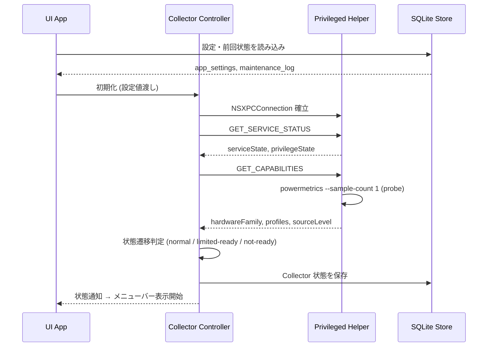
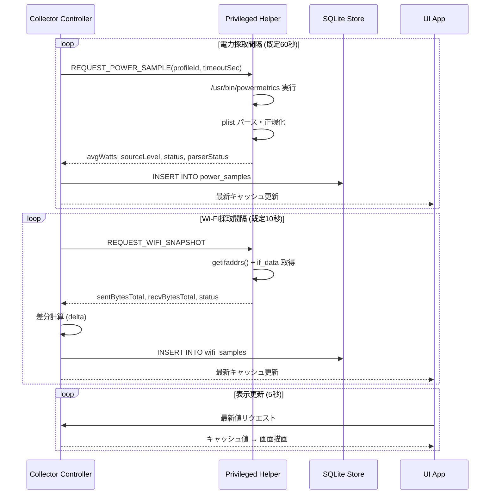
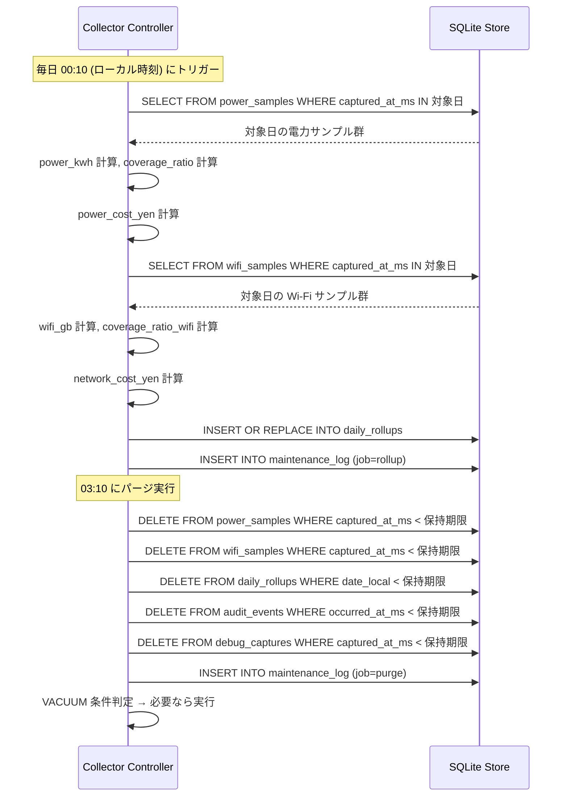

# macOS 常駐監視アプリ 詳細設計書 v4.0

## 全面再構成版 — 状態コード統合・特権 Helper 確定・集計算式明記・セキュリティ強化

| 文書種別 | 詳細設計書（完全版） |
|---|---|
| 対象プロダクト | Mac の消費電力・Wi-Fi 使用量・概算金額を可視化するメニューバー常駐アプリ |
| 対象 OS | macOS 13.3 Ventura 以降 |
| 主要前提 | 電力取得の一次ソースは powermetrics。UI は非特権、権限処理は Privileged Helper（LaunchDaemon）に限定する。 |
| 配布方針 | Developer ID 署名、Hardened Runtime、有効な Notarization を満たした DMG 直接配布 |
| App Sandbox | 不採用（確定）。powermetrics が必要とする XPC ⇔ LaunchDaemon 通信と DB パスの自由度を優先する。 |
| 版数 | v4.0 |
| 作成日 | 2026-03-19 |

---

## 第 0 章 文書管理

| 項目 | 内容 |
|---|---|
| 文書の目的 | 開発者がこの文書のみで UI 実装、Collector 実装、Helper 実装、DB 実装、QA 準備に着手できる状態を作る。 |
| 想定読者 | macOS エンジニア、QA、プロダクトオーナー、リリース担当 |
| 文書の位置づけ | 詳細設計書。実装粒度の入出力、異常系、データ設計、通信仕様、セキュリティ、配布要件まで含む。 |
| 対象外 | クラウド同期、複数端末統合管理、アプリ別通信量の厳密追跡、外部ワットメーター連携 |

### 0.1 改訂履歴

| 版数 | 日付 | 変更内容 |
|---|---|---|
| v1.0 | 2026-03-08 | 初版。基本設計書として作成。 |
| v2.0 | 2026-03-08 | powermetrics 前提、権限分離、配布設計を反映。 |
| v2.2 | 2026-03-08 | 詳細設計版。画面、DB、XPC、異常系の主要項目を追加。 |
| v3.0 | 2026-03-08 | レビュー指摘の不足項目を全補完し完全版へ再構成。 |
| v3.1 | 2026-03-08 | G-006 欠測/エラー状態画面の詳細仕様を追加。 |
| v4.0 | 2026-03-19 | 全面再構成。状態コード統合、Helper 方式確定（LaunchDaemon + SMAppService）、集計・料金算式の明記、XPC 全コマンド Schema 完備、セキュリティ章新設、ライフサイクル章新設、セクション番号修正、画面 ID 一覧追加。 |
| v4.1 | 2026-03-19 | 残存問題の全面修正。(A) plist キーパスを Apple Silicon/Intel 別に正確化、対象 OS を macOS 13.3+ に変更、Wi-Fi カウンタ API を getifaddrs()+if_data に確定。(B) シーケンス図 3 本追加、設定依存バリデーション表追加、Helper 更新フロー追加、月次リセット日とロールアップの関係明記、audit_events detail_json 構造定義追加、ポップオーバーレイアウト仕様追加、アクセシビリティラベル一覧追加。(C) outlier 閾値を 600W に変更、メモリキャッシュ上限の計算根拠追記。 |
| v4.2 | 2026-03-19 | 推敲修正。(A) セクション番号の重複修正 (2.4→2.5/2.6)。(B) source_level=A の条件で `package_watts` を `package_power` に修正。(C) M-005 の条件を「取得または解析失敗」に拡張し PWR-001 との整合確保。(D) 第 18 章の決定ログを D-01〜D-10 全件に補完。(E) REQUEST_POWER_SAMPLE の XPC タイムアウトに根拠注記追加。(F) sample_duration_sec の型を INTEGER→REAL に修正 (10.2節/DDL/XPC Schema)。(G) CSV raw_power に outlier_flag カラム追加。(H) 5.4.1 の 0 円バリデーション矛盾を解消。(I) 付録 A.6 に counterResetFlag の責務注記追加。(J) Markdown 書式修正 (コードブロック言語指定、見出し前後の空行)。 |
| v4.3 | 2026-03-19 | 推敲 2 周目修正。(A) セクション番号の欠番修正 (2.5/2.6→2.4/2.5)。(B) 9.2 節に coverage_ratio の「集計対象秒数」の定義を追記 (86,400 秒固定、sleep 除外なし、当日は経過秒数)。 |

### 0.2 用語定義

| 用語 | 定義 |
|---|---|
| UI App | メニューバー表示、ポップオーバー、詳細画面、設定、CSV 出力を担当するアプリ本体。非特権で動作する。 |
| Collector Controller | サンプリングのスケジューリング、XPC 呼び出し、保存トリガー、状態管理を担当する内部層。UI App プロセス内で動作する Swift actor。 |
| Privileged Helper | powermetrics 実行とシステム計測を担当する権限付き補助プロセス。LaunchDaemon として登録する。 |
| 欠測 (missing) | 取得対象値が得られず、計算や表示を成立させられない状態。 |
| stale | 直近サンプルは存在するが鮮度閾値を超えたため最新値として扱えない状態。 |
| ロールアップ (rollup) | 生サンプルを日次に再集計して長期保存量を抑える処理。 |
| coverage_ratio | 計測期間中に有効サンプルが存在する割合。0.0〜1.0。 |
| GB | 10^9 バイト（SI 基準）。本アプリでは 1 GB = 1,000,000,000 bytes とする。 |

### 0.3 v3.1 からの主要変更サマリ

| 変更区分 | 内容 |
|---|---|
| 状態コード | M-001〜M-009 を 1 つの正規表に統合。v3.1 の 5.5 節と 5.6 節の M-005〜M-007 の矛盾を解消。 |
| Helper 方式 | 「XPC service / LaunchDaemon 系」を **LaunchDaemon + SMAppService** に確定。plist、MachService 名、昇格手順、署名要件を新設の第 3 章に記載。 |
| 集計・料金 | power_kwh / wifi_gb / coverage_ratio / 料金の計算式を数式付きで新設の第 9 章に記載。 |
| セキュリティ | XPC peer 認証、audit token 検証、コマンド実体パス固定を新設の第 12 章に記載。 |
| ライフサイクル | sleep/wake、蓋閉じ、時刻変更、DST、ディスクフルを新設の第 14 章に記載。 |
| XPC Schema | 全 8 コマンドの payload / response schema を付録 A に完備。 |
| エラーコード | IPC-002/003/005/006、DBG-001 を追加定義。 |
| DB セクション番号 | 8.2 の重複を 8.2〜8.8 に修正。debug_captures テーブルを追加。 |
| 画面 ID | G-001〜G-006 の一覧表を追加。 |
| App Sandbox | 不採用を確定。理由を第 3 章 ADR に記載。 |

---

## 第 1 章 目的と適用範囲

本システムは、Mac の消費電力と Wi-Fi 使用量を継続収集し、メニューバーからリアルタイム値、履歴、概算金額、異常状態を可視化するローカル常駐アプリである。電力取得の一次ソースは powermetrics とし、取得できない環境では無理な推定を行わず欠測として扱う。

### 1.1 システム目的

- 利用者が「いまどれだけ使っているか」「今日・今月でどの程度の量と金額感か」を即座に把握できるようにする。
- 権限不足や非対応機種による欠測を曖昧な 0 値で隠さず、理由と対処を提示する。
- 単一端末内で完結する軽量な監視ツールとし、外部クラウド依存を持たせない。

### 1.2 適用範囲

| 区分 | 内容 |
|---|---|
| 対象 | メニューバー常駐、ポップオーバー、履歴画面、設定画面、初回セットアップ、CSV 出力、ローカル DB 保存、ログイン時起動、診断表示 |
| 非対象 | アプリ別通信量の厳密集計、複数端末の一元管理、法人向け管理ポータル、外部メーター連携 |

---

## 第 2 章 システム概要とアーキテクチャ

アプリは UI App、Collector Controller、Privileged Helper、SQLite Store の 4 層で構成する。UI は非特権を維持し、powermetrics の実行と機種依存差分の吸収は Helper に集約する。

### 2.1 コンポーネント責務

| コンポーネント | 実装技術 | 責務 | 権限 |
|---|---|---|---|
| UI App | SwiftUI + AppKit (NSStatusItem) | メニューバー表示、ポップオーバー、詳細画面、設定、CSV 出力、通知 | 一般ユーザー |
| Collector Controller | Swift actor（UI App プロセス内） | タイマー制御、XPC 呼び出し、状態遷移、DB 保存、ロールアップ開始 | 一般ユーザー |
| Privileged Helper | LaunchDaemon（SMAppService 登録） | powermetrics 実行、Wi-Fi カウンタ取得、能力検出、パース正規化 | root |
| SQLite Store | SQLite 3 (WAL モード) | 時系列データ、設定、集計、監査ログ、マイグレーション管理 | 一般ユーザー |

### 2.2 プロセス構成図

```text
┌─────────────────────────────────────────────┐
│  UI App (non-privileged, user session)      │
│  ┌──────────────────┐  ┌─────────────────┐  │
│  │  SwiftUI Views   │  │  Collector      │  │
│  │  (G-001〜G-006)  │←→│  Controller     │  │
│  └──────────────────┘  │  (Swift actor)  │  │
│                        └────────┬────────┘  │
│                                 │ XPC        │
│  ┌──────────────────────────────┘            │
│  │  SQLite Store (WAL mode)                  │
│  │  ~/Library/Application Support/           │
│  │    <bundle-id>/monitor.sqlite3            │
│  └──────────────────────────────────────────┘│
└─────────────────────────────────────────────┘
                    │ NSXPCConnection
                    ▼
┌─────────────────────────────────────────────┐
│  Privileged Helper (LaunchDaemon, root)     │
│  MachService: <bundle-id>.helper            │
│  ┌────────────┐  ┌────────────────────────┐ │
│  │ XPC        │  │ powermetrics executor  │ │
│  │ Listener   │  │ Wi-Fi counter reader   │ │
│  │            │  │ Capability probe       │ │
│  └────────────┘  └────────────────────────┘ │
└─────────────────────────────────────────────┘
```

### 2.3 シーケンス図

#### 2.3.1 起動シーケンス



#### 2.3.2 サンプリングシーケンス



#### 2.3.3 ロールアップシーケンス



### 2.4 基本シーケンス

1. 起動時に UI App が SQLite Store から設定と前回 Collector 状態を読み込む。
2. Collector Controller が NSXPCConnection で Helper に接続し、`GET_SERVICE_STATUS` → `GET_CAPABILITIES` を呼ぶ。
3. 能力検出結果に基づき Collector は `normal` / `limited-ready` / `not-ready` に遷移する。
4. Collector は設定された間隔で `REQUEST_POWER_SAMPLE` / `REQUEST_WIFI_SNAPSHOT` を送信し、結果を SQLite に保存する。
5. UI は Collector の最新キャッシュと DB から値を取得し、5 秒ごとに表示を更新する。
6. 毎日 00:10 にロールアップ、03:10 にパージを実行する。

### 2.5 Collector Controller 状態遷移図

```text
                    ┌──────────┐
          起動 ────→│ starting │
                    └────┬─────┘
                         │ GET_CAPABILITIES 完了
                    ┌────▼─────────────┐
        ┌──────────→│     normal       │←────────────┐
        │           └────┬─────────────┘              │
        │                │ 3 連続失敗                   │ 成功サンプル取得
        │           ┌────▼─────────────┐              │
        │           │    degraded      │──────────────┘
        │           └────┬─────────────┘
        │                │ 能力なし確定
        │           ┌────▼─────────────┐
        │           │  limited-ready   │  ← 電力欠測だが Wi-Fi は継続
        │           └──────────────────┘
        │
        │           ┌──────────────────┐
        └───────────│    not-ready     │  ← Helper 未登録/権限なし
                    └──────────────────┘
                         ↑ 権限付与で starting へ戻る
```

| 遷移元 | 遷移先 | 条件 |
|---|---|---|
| starting | normal | GET_CAPABILITIES で power profile ≥ 1 件かつ Wi-Fi OK |
| starting | limited-ready | Wi-Fi OK だが power profile = 0 件 |
| starting | not-ready | Helper 未登録 / 権限拒否 |
| normal | degraded | 電力サンプル 3 連続失敗 |
| degraded | normal | 成功サンプル 1 件取得 |
| degraded | limited-ready | 10 連続失敗かつ profile 再検証で 0 件 |
| not-ready | starting | 権限付与 / Helper 再登録成功 |

---

## 第 3 章 設計上の決定事項 (ADR)

### 3.1 確定済み決定

| ID | 決定事項 | 内容 | 理由 |
|---|---|---|---|
| D-01 | 電力取得一次ソース | powermetrics | macOS で比較的高精度な電力関連指標を取得でき、CLI ベースで自動化しやすい |
| D-02 | 対象 OS | macOS 13.3+ | SMAppService.daemon による Helper 登録の公式 API が利用可能。macOS 13.0〜13.2 では SMAppService.daemon の登録が失敗するバグが確認されているため 13.3 以降を対象とする |
| D-03 | UI と権限の分離 | UI は非特権、権限処理は Helper に隔離 | 最小権限の原則。UI のクラッシュが root プロセスに波及しない |
| D-04 | 金額の扱い | ユーザー設定ベースの概算（税別） | 契約や単価を暗黙推定しない。税込/税別は表示ラベルで注記 |
| D-05 | 保存時刻 | UTC (Epoch ms) | 集計と CSV の整合を保ちやすい。ローカル日付への変換は表示・集計時に行う |
| D-06 | 配布形態 | Developer ID 署名済み DMG | 社内・外部配布の両立がしやすい |
| D-07 | App Sandbox | **不採用** | powermetrics 実行に必要な LaunchDaemon XPC、DB パスの自由度、Helper 登録を Sandbox 内で安全に実現する方法が確立されていないため |
| D-08 | Helper 方式 | **LaunchDaemon + SMAppService.daemon** | 下記 3.2 節参照 |
| D-09 | Wi-Fi 使用量の定義 | sent_bytes + recv_bytes の合算（LAN 含む） | OS レベルのインターフェースカウンタは WAN/LAN を区別しない。UI に「LAN 通信を含む」旨を注記する |
| D-10 | DB 同時アクセス | SQLite WAL モード | Collector（書き込み）と UI（読み取り）の並行アクセスをロックなしで実現 |

### 3.2 ADR: Privileged Helper の実装方式

**決定**: LaunchDaemon として実装し、SMAppService.daemon で登録する。

**代替案と却下理由**:

| 方式 | 却下理由 |
|---|---|
| XPC Service (embedded) | App Sandbox 前提。非 Sandbox では LaunchDaemon のほうが権限制御が明確 |
| AuthorizationExecuteWithPrivileges | 非推奨 API。Apple が削除予定を示唆 |
| setuid バイナリ | Hardened Runtime と Notarization で拒否される |

**登録フロー**:

1. UI App が `SMAppService.daemon(plistName:)` を呼び出す。
2. plist ファイル名: `<bundle-id>.helper.plist`
3. OS がユーザーに管理者パスワードを要求する（UI App は直接パスワードを扱わない）。
4. 承認されると `/Library/LaunchDaemons/<bundle-id>.helper.plist` にインストールされ、Helper が起動する。
5. Helper は `NSXPCListener(machServiceName:)` で XPC リスナーを開始する。

**plist 要件**:

| キー | 値 |
|---|---|
| Label | `<bundle-id>.helper` |
| MachServices | `{ "<bundle-id>.helper": true }` |
| ProgramArguments | `["/Library/PrivilegedHelperTools/<bundle-id>.helper"]` |
| RunAtLoad | true |
| KeepAlive | true |

**署名要件**:

| 項目 | 要件 |
|---|---|
| Helper バイナリ | Developer ID Application 署名 + Hardened Runtime |
| Info.plist 内 SMAuthorizedClients | UI App の signing identifier を指定 |
| UI App の Info.plist 内 SMPrivilegedExecutables | Helper の signing identifier を指定 |
| Entitlements (Helper) | なし（Sandbox 不使用のため） |
| Entitlements (UI App) | なし（Sandbox 不使用のため） |

### 3.3 オープン事項

| ID | 内容 | 現時点の扱い |
|---|---|---|
| O-01 | 自動更新方式の採否 | v1 リリース後に判断。手動更新を基本とする |
| O-02 | 長期保持を 365 日超へ拡張するか | 利用実績を見て判断 |

---

## 第 4 章 機能要件詳細

各機能について、動作条件、入出力、初期値、設定可能範囲、正常系・異常系を定義する。

### 4.1 機能一覧

| 機能ID | 機能名 | 優先度 | 概要 |
|---|---|---|---|
| F-001 | 初回セットアップ | Must | 権限説明、初期設定、動作確認をガイド形式で実施 |
| F-002 | ログイン時起動 | Must | ユーザー設定に基づきログイン時起動を有効化 |
| F-003 | 電力サンプリング | Must | powermetrics を用いた電力計測と正規化 |
| F-004 | Wi-Fi サンプリング | Must | Wi-Fi インターフェースのバイト差分取得 |
| F-005 | リアルタイム表示 | Must | メニューバーとポップオーバーへの最新値表示 |
| F-006 | 履歴グラフ | Must | 期間別の推移表示 |
| F-007 | 概算料金計算 | Must | 電力単価と通信契約モデルに基づく概算値計算 |
| F-008 | 欠測/異常表示 | Must | 欠測理由と対処の表示 |
| F-009 | CSV エクスポート | Should | 時系列/日次集計を CSV で出力 |
| F-010 | 設定管理 | Must | 料金、収集、保持、表示オプションの保存 |
| F-011 | 監査ログ/診断 | Should | 権限・失敗・解析状況の記録 |
| F-012 | データ保守 | Must | ロールアップ、パージ、マイグレーション |

### F-001 初回セットアップ

| 項目 | 内容 |
|---|---|
| 動作条件 | 初回起動時、または `setup_completed_at` が未設定のとき |
| 入力 | ログイン時起動、電力単価、通信契約モデル、保持期間、採取間隔 |
| 出力 | 設定保存、Helper 登録状態、試験採取結果 |
| 初期値 | 電力単価 31.0 円/kWh、電力採取 60 秒、Wi-Fi 採取 10 秒、保持期間 90 日 |
| 設定可能範囲 | 電力単価 0.00〜999.99、保持期間 7〜365 日 |
| 正常系 | 説明 → 権限付与 → 設定入力 → 単発採取 → 完了 |
| 異常系 | 権限拒否時はスキップせず未完了状態で終了。再開ボタンを表示 |

### F-002 ログイン時起動

| 項目 | 内容 |
|---|---|
| 動作条件 | 設定画面でトグル変更時 |
| 入力 | `enable_launch_at_login: bool` |
| 出力 | SMAppService.LoginItem 状態、監査ログ |
| 初期値 | 初回セットアップ時に ON を既定提示。ユーザーが変更可能 |
| 設定可能範囲 | ON / OFF |
| 正常系 | `SMAppService.loginItem.register()` / `unregister()` を呼び、成功なら UI を更新 |
| 異常系 | 失敗時は元の状態に戻し、理由を表示 |

### F-003 電力サンプリング

| 項目 | 内容 |
|---|---|
| 動作条件 | Collector の周期実行または手動再試行 |
| 入力 | `sampling_profile_id`、`timeout_sec`、`captured_at` |
| 出力 | `avg_watts`、`source_level`、`status`、`parser_status`、`error_code` |
| 初期値 | 採取間隔 60 秒、タイムアウト 8 秒 |
| 設定可能範囲 | 採取間隔 30〜300 秒、タイムアウト 5〜15 秒 |
| 正常系 | Helper が powermetrics を単発実行し、パース結果の `avg_watts` を返却 |
| 異常系 | タイムアウト、解析失敗、権限不足、非対応機種は `status=missing` / `fail` |

### F-004 Wi-Fi サンプリング

| 項目 | 内容 |
|---|---|
| 動作条件 | Collector の周期実行または状態変化検知時 |
| 入力 | `interface_name`、`previous_counter`、`current_counter` |
| 出力 | `sent_bytes_delta`、`recv_bytes_delta`、`counter_reset_flag` |
| 初期値 | 採取間隔 10 秒 |
| 設定可能範囲 | 採取間隔 5〜60 秒 |
| 正常系 | 差分が正値ならそのまま保存 |
| 異常系 | 差分が負値なら `reset_flag=1` を立て、そのサンプルの delta は 0 として保存（欠測扱い） |

### F-005 リアルタイム表示

| 項目 | 内容 |
|---|---|
| 動作条件 | UI 表示中 |
| 入力 | 最新サンプル、Collector 状態、設定 |
| 出力 | メニューバー文言、ポップオーバー現在値 |
| 初期値 | 表示更新間隔 5 秒（固定） |
| 設定可能範囲 | 固定 5 秒。ユーザー設定対象外 |
| 正常系 | 鮮度内サンプルを表示 |
| 異常系 | 鮮度切れは「更新待ち」、欠測は原因別文言 |
| 鮮度閾値 | 電力: 採取間隔 × 2（既定 120 秒）、Wi-Fi: 採取間隔 × 3（既定 30 秒） |

### F-006 履歴グラフ

| 項目 | 内容 |
|---|---|
| 動作条件 | 詳細画面の History タブ表示時 |
| 入力 | 表示期間、対象メトリクス |
| 出力 | 折れ線/棒グラフ、平均値ラベル |
| 初期値 | 期間 24 時間、スケール自動 |
| 設定可能範囲 | 1 時間、24 時間、7 日、30 日、90 日。スケール: 自動/固定最大 |
| 正常系 | 期間に応じて raw / rollup を切替表示 |
| 異常系 | データ不足時は空状態メッセージを表示 |

### F-007 概算料金計算

| 項目 | 内容 |
|---|---|
| 動作条件 | 表示更新または日次ロールアップ時 |
| 入力 | `power_kwh`、`wifi_gb`、電力単価、通信契約モデル |
| 出力 | `day_cost_yen`、`month_cost_yen`、`coverage_ratio` |
| 初期値 | 電力単価 31.0 円/kWh、通信は `fixed`（固定月額）モデル未設定 |
| 設定可能範囲 | fixed / metered / capped_metered |
| 正常系 | 契約モデルに従い算出（計算式は第 9 章参照） |
| 異常系 | 欠測区間がある場合は coverage_ratio を併記 |

### F-008 欠測/異常表示

| 項目 | 内容 |
|---|---|
| 動作条件 | `error_code` または `missing` 状態検知時 |
| 入力 | `state_code`、`last_success_at`、`source_level` |
| 出力 | バナー、バッジ、ヘルプ文言 |
| 正常系 | 統合状態コード表（第 6 章）に従い原因別テンプレートで表示 |
| 異常系 | 複数エラー時は最優先度の高いものを主表示 |

### F-009 CSV エクスポート

| 項目 | 内容 |
|---|---|
| 動作条件 | Export タブで出力指示時 |
| 入力 | `export_type`、`date_from`、`date_to`、`output_path` |
| 出力 | CSV ファイル |
| 初期値 | UTF-8 with BOM、CRLF、ヘッダー行あり |
| 設定可能範囲 | raw_power / raw_wifi / daily_rollup |
| 正常系 | 指定期間のレコードを `captured_at_ms` 昇順で出力 |
| 異常系 | 書き込み失敗時は保存先変更を促すダイアログ |

### F-010 設定管理

| 項目 | 内容 |
|---|---|
| 動作条件 | 設定画面で変更後保存時 |
| 入力 | key / value |
| 出力 | 保存結果、UI 再反映 |
| 正常系 | 保存成功時にトースト通知。Collector は非同期で設定再読込 |
| 異常系 | 不正値は保存せず項目ごとにインラインメッセージ表示 |

### F-011 監査ログ/診断

| 項目 | 内容 |
|---|---|
| 動作条件 | 権限操作、失敗、設定変更、保守実行時 |
| 入力 | `event_type`、`severity`、`detail_json` |
| 出力 | `audit_events` テーブル、`os.Logger` (unified logging) |
| 初期値 | info 以上を DB 保存。debug は `debug_capture_enabled=true` 時のみ |
| 正常系 | PII を含めず構造化ログで保存 |
| 異常系 | DB 不可時は unified logging のみ（ファイルへの独自ログ出力はしない） |

### F-012 データ保守

| 項目 | 内容 |
|---|---|
| 動作条件 | 毎日 00:10 / 03:10（ローカル時刻）、および起動時に前回未実行なら即時 |
| 入力 | `retention_days`、`user_version` |
| 出力 | 削除件数、ロールアップ件数、migration 結果 |
| 初期値 | パージ 03:10、保持 90 日、日次ロールアップ 00:10 |
| 設定可能範囲 | 保持期間 7〜365 日。パージ時刻は固定 |
| 正常系 | ロールアップ → パージ → VACUUM 条件判定 |
| 異常系 | migration 失敗時は起動を中断しバックアップ復旧。復旧不可なら read-only 診断モード |
| VACUUM 条件 | 前回 VACUUM から 7 日以上経過 かつ 累計削除行数 > 10,000 行 |

### 4.2 更新間隔・表示期間サマリ

| 項目 | 初期値 | 最小 | 最大 | 備考 |
|---|---|---|---|---|
| メニューバー表示更新 | 5 秒 | 固定 | 固定 | 表示のみ更新 |
| 電力採取間隔 | 60 秒 | 30 秒 | 300 秒 | powermetrics 実行間隔 |
| Wi-Fi 採取間隔 | 10 秒 | 5 秒 | 60 秒 | 差分集計間隔 |
| グラフ期間 | 24 時間 | 1 時間 | 90 日 | 1時間/24時間/7日/30日/90日 |
| 電力 stale 閾値 | 採取間隔 × 2 | — | — | 既定 120 秒 |
| Wi-Fi stale 閾値 | 採取間隔 × 3 | — | — | 既定 30 秒 |

---

## 第 5 章 画面仕様

### 5.1 画面 ID 一覧

| 画面ID | 画面名 | 概要 |
|---|---|---|
| G-001 | メニューバー | NSStatusItem。アイコンと短縮テキスト |
| G-002 | ポップオーバー | メニューバークリックで表示。現在値、ミニグラフ、状態 |
| G-003 | 詳細画面 (History) | 履歴グラフ、CSV エクスポート |
| G-004 | 設定画面 | 料金設定、採取間隔、保持期間、診断リンク |
| G-005 | 初回セットアップ | ウィザード形式の初期設定 |
| G-006 | 欠測/エラー状態画面 | 原因の明示、影響範囲、推奨アクション、再試行 |

### 5.2 G-001 メニューバーアイコン仕様

| 状態 | アイコン | 表示テキスト | ツールチップ |
|---|---|---|---|
| 通常 | 電力アイコン（通常色） | `42W / 1.2GB` | 最新更新時刻と今日の概算金額 |
| 欠測 | 注意アイコン（黄） | `未測定` | 原因の短縮文言 |
| 重大エラー | エラーアイコン（赤） | `要確認` | 「詳細を開いて対処を確認」 |
| 縮退表示 | アイコンのみ | なし | 通常/欠測/エラーに応じたツールチップ |

アイコンサイズ: 18×18 pt (テンプレート画像、@1x/@2x 提供)。ダークモード対応。

### 5.3 G-002 ポップオーバー画面

| 項目 | 型 | データ源 | 初期表示 | 更新 |
|---|---|---|---|---|
| 現在電力 | 数値 + 単位 (W) | power_samples 最新 | `読み込み中` | 5 秒 |
| 直近平均電力 | 数値 + 単位 (W) | 直近 1 時間の平均 | `—` | 5 秒 |
| 今日の Wi-Fi 使用量 | 数値 + 単位 (適応: B/KB/MB/GB) | wifi_samples 日次集計 | `0 B` | 5 秒 |
| 今日の概算電気代 | 通貨 (円、税別) | daily_rollups | `未計算` | 5 秒 |
| 今日の概算通信費 | 通貨 (円、税別) | daily_rollups | `未計算` | 5 秒 |
| 1 時間ミニグラフ | 折れ線グラフ | raw power_samples | 空グラフ | 5 秒 |
| 最終更新時刻 | 日時 (HH:mm:ss) | Collector 状態 | `—` | 5 秒 |
| 状態メッセージ | テキスト | state_code / source_level | `正常` | 変化時 |
| 「詳細を見る」 | ボタン | 固定 | 有効 | 固定 |
| 「再試行」 | ボタン | 状態依存 | 通常は非表示 | 変化時 |

注記: 「概算値であり、実際の請求額とは異なります」を常時フッタに表示する。

#### 5.3.1 ポップオーバーレイアウト仕様

| 項目 | 値 | 備考 |
|---|---|---|
| 幅 | 320pt（固定） | Dynamic Type による拡大時も幅は固定。テキストは折り返しで対応 |
| 最小高さ | 280pt | 全項目が最小サイズで表示される場合の高さ |
| 最大高さ | 480pt | 超過時はコンテンツ領域にスクロールビューを適用 |
| 外側マージン | 12pt | ポップオーバー内部のコンテンツ領域と外枠の間隔（上下左右均等） |
| セクション間スペーシング | 8pt | 各表示セクション（現在値、グラフ、ステータス等）の間隔 |
| スクロール対象 | コンテンツ領域全体 | ヘッダ（アプリ名）とフッタ（注記テキスト）はスクロール外に固定 |

### 5.4 G-004 設定画面

| ラベル | キー | 型 | 初期値 | バリデーション | 格納カラム |
|---|---|---|---|---|---|
| ログイン時に起動 | `launch_at_login_enabled` | bool | true | なし | value_bool |
| 電力単価 (円/kWh、税別) | `electricity_unit_price_yen` | decimal | 31.0 | 0.00〜999.99 | value_number |
| 通信契約モデル | `network_tariff_model` | enum | `fixed` | fixed / metered / capped_metered | value_text |
| 固定月額 (円) | `monthly_fee_yen` | decimal | 0 | 0.00〜999999.99。`fixed` / `capped_metered` 時のみ有効 | value_number |
| GB 単価 (円) | `price_per_gb_yen` | decimal | 0 | 0.00〜9999.99。`metered` / `capped_metered` 時のみ有効 | value_number |
| 月額上限 (円) | `max_monthly_fee_yen` | decimal | 0 | 0.00〜999999.99。`capped_metered` 時のみ有効 | value_number |
| 電力採取間隔 (秒) | `power_sampling_interval_sec` | int | 60 | 30〜300 | value_number |
| Wi-Fi 採取間隔 (秒) | `wifi_sampling_interval_sec` | int | 10 | 5〜60 | value_number |
| 保持期間 (日) | `retention_days` | int | 90 | 7〜365 | value_number |
| デバッグ採取保存 | `debug_capture_enabled` | bool | false | なし | value_bool |
| ログレベル | `log_level` | enum | `info` | debug / info / warn / error | value_text |
| 月次リセット日 | `monthly_reset_day` | int | 1 | 1〜28 | value_number |

#### 5.4.1 network_tariff_model 依存バリデーション

`network_tariff_model` の値に応じて、通信料金関連フィールドの必須/無効状態が変わる。UI は無効なフィールドをグレーアウトし、入力を受け付けない。保存時に依存バリデーションを実施し、不整合がある場合はインラインエラーを表示する。

| フィールド (キー) | `fixed` | `metered` | `capped_metered` |
|---|---|---|---|
| `monthly_fee_yen` (固定月額) | **必須** | 無効 (NULL で保存) | **必須** |
| `price_per_gb_yen` (GB 単価) | 無効 (NULL で保存) | **必須** | **必須** |
| `max_monthly_fee_yen` (月額上限) | 無効 (NULL で保存) | 無効 (NULL で保存) | **必須** |

- 「必須」のフィールドが未入力の場合、保存時にバリデーションエラーとする。ただし 0 は有効な値として許容する（例: 無料プランの場合は `fixed` + `monthly_fee_yen=0`、`metered` で従量単価が 0 円のケース等）。
- `network_tariff_model` を切り替えた際、無効になるフィールドの既存値はクリアせず保持する（再度有効になったときに復元するため）。ただし DB 保存時には無効フィールドの値を NULL とする。

### 5.5 G-005 初回セットアップフロー

| ステップ | 名称 | 入力/操作 | 完了条件 |
|---|---|---|---|
| 1 | 概要説明 | 監視対象、概算値の注意、必要権限を表示 | 「次へ」押下 |
| 2 | Helper 登録 | `SMAppService.daemon` による Helper 登録。OS が管理者パスワードを要求 | Collector 状態が `normal` / `limited-ready` |
| 3 | 料金設定 | 電力単価と通信モデルを入力 | 必須項目が妥当値 |
| 4 | 試験採取 | 電力/Wi-Fi の単発採取を実行 | 少なくとも Wi-Fi 成功、電力は成功または欠測理由確定 |
| 5 | 完了 | 結果と次の行動を表示 | `setup_completed_at` 保存 |

### 5.6 グラフ仕様

| 画面 | 期間 | データ源 | 既定スケール | グラフ種類 | 補足 |
|---|---|---|---|---|---|
| G-002 ポップオーバー | 1 時間 | raw power_samples | 自動 | 折れ線 | ミニグラフ。点数を間引かない |
| G-003 History | 24 時間 | raw samples | 自動 | 電力: 折れ線、Wi-Fi: 積み上げ棒 | |
| G-003 History | 7 日 | daily_rollups | 自動 | 棒グラフ | 日単位の平均(電力)/合計(Wi-Fi) |
| G-003 History | 30 日 | daily_rollups | 自動 | 棒グラフ | バー幅固定 |
| G-003 History | 90 日 | daily_rollups | 固定最大/自動切替可 | 棒グラフ | 長期比較用 |

---

## 第 6 章 統合状態コード表

v3.1 で 5.5 節と 5.6 節に分散していた状態コードを 1 つに統合し、矛盾を解消する。本表が全画面・ログ・エラーハンドリングの唯一の正規定義である。

### 6.1 状態コード正規表

| コード | 条件 | severity | retryable | 影響範囲 | ユーザー向け文言 | 主操作 | 通知方針 | 自動復帰 |
|---|---|---|---|---|---|---|---|---|
| M-001 | 管理者権限未付与 | fatal | false | 電力 | 電力計測に必要な権限が未付与です | セットアップを再開 | 通知あり | 権限付与後に自動再試行 |
| M-002 | Helper 未登録/起動不可 | fatal | true | 電力+Wi-Fi | 計測ヘルパーを開始できません | 登録を再試行 | 通知あり | 成功時に復帰通知 |
| M-003 | powermetrics 非対応/メトリクス欠測 | degraded | false | 電力 | この環境では電力値を取得できません | ヘルプを開く | 初回のみ | 自動復帰なし |
| M-004 | 起動直後の取得待ち | informational | false | 電力+Wi-Fi | 最新データを取得中です | 自動更新待ち | 通知なし | 成功時に自動消去 |
| M-005 | 電力データの取得または解析失敗 | degraded | true | 電力 | 電力データの取得または解析に失敗しました | 再試行 / 診断表示 | 継続時のみ | 次回成功で復帰 |
| M-006 | Wi-Fi インターフェース不明 | degraded | true | Wi-Fi | Wi-Fi インターフェースを特定できません | ネットワーク状態を確認 | 継続時のみ | インターフェース検出で復帰 |
| M-007 | stale 継続（鮮度閾値超過） | degraded | true | 電力/Wi-Fi（該当側） | データが古くなっています。表示値は参考値です | 再試行 | 5 分以上継続時 | 新規サンプル取得で復帰 |

**M-007 遷移ルール**: M-007 は単発のエラーや失敗で即座に発生するものではない。PWR-004 / IPC-004 等の失敗が発生した時点では M-005 を表示し、`last_success_at` からの経過時間が鮮度閾値（電力: 採取間隔×2、Wi-Fi: 採取間隔×3）を超えた時点で初めて M-007 に遷移する。成功サンプルを 1 件取得した時点で M-007 は解除される。
| M-008 | DB 障害（オープン失敗/書込失敗） | fatal | true | 保存 | 保存領域にアクセスできません | 保存先を確認 / 再起動 | 通知あり | 回復後に復帰通知 |
| M-009 | Wi-Fi 未接続 | informational | false | Wi-Fi | Wi-Fi が接続されていません | ネットワーク設定を開く | 任意 | 再接続で自動復帰 |

### 6.2 状態の優先順位

複数の状態コードが同時に発生した場合、以下の優先順位で最上位 1 件を G-006 の主表示とし、他は折りたたみ一覧に表示する。

| 優先順位 | severity | 対象コード |
|---|---|---|
| 1 | fatal | M-008 (DB 障害) |
| 2 | fatal | M-001 (権限未付与)、M-002 (Helper 未登録) |
| 3 | degraded | M-003 (非対応)、M-005 (解析失敗) |
| 4 | degraded | M-007 (stale)、M-006 (Wi-Fi IF 不明) |
| 5 | informational | M-009 (Wi-Fi 未接続) |
| 6 | informational | M-004 (取得待ち) |

### 6.3 G-006 欠測/エラー状態画面の詳細仕様

G-006 は、欠測またはエラー状態が発生したときに原因、影響範囲、直近発生時刻、推奨アクション、再試行導線を提示する専用画面。ポップオーバー (G-002)、ローカル通知、設定画面 (G-004) の診断リンクから遷移できる。

**表示項目**:

| セクション | 項目 | 型 | 初期値 | 表示ルール |
|---|---|---|---|---|
| ヘッダ | 状態アイコン | icon | warning | fatal=赤、degraded=黄、informational=灰 |
| ヘッダ | 状態タイトル | text | 問題を確認しています | 状態コードに応じた固定文言（6.1 表の「ユーザー向け文言」） |
| 概要 | 主メッセージ | multiline text | 取得状態を確認中です | 原因と影響範囲を 2〜3 行で説明 |
| 概要 | 発生時刻 | datetime | — | 最初に検知した時刻をローカル表記 (yyyy-MM-dd HH:mm:ss) |
| 概要 | 最終成功時刻 | datetime | — | 直近正常サンプルがあれば表示 |
| 概要 | 影響範囲 | tag list | — | 電力のみ / Wi-Fi のみ / 両方 / 保存のみ |
| 診断 | 状態コード | text | — | `M-001` 等のユーザー向けコードを表示 |
| 診断 | 内部エラーコード | text | — | `AUTH-001` 等。`debug_capture_enabled=true` 時のみコピー可能 |
| 操作 | 再試行 | button | enabled | `retryable=true` のときのみ有効 |
| 操作 | セットアップを再開 | button | hidden | M-001 / M-002 時のみ表示 |
| 操作 | 設定を開く | button | enabled | 常時表示。G-004 の該当セクションに遷移 |
| 操作 | ログを開く | button | hidden | `debug_capture_enabled=true` のときのみ表示 |
| フッタ | 閉じる | button | enabled | 画面を閉じて前画面へ戻る |

---

## 第 7 章 電力取得詳細設計

電力取得は powermetrics を一次ソースとする。出力内容は機種・OS・権限で変化するため、Helper は capability probe とパーサー正規化を行う。

### 7.1 powermetrics 実行仕様

| 項目 | 仕様 |
|---|---|
| 実行方式 | Helper が `Process()` (Swift の Foundation) で子プロセスとして起動 |
| コマンド | `/usr/bin/powermetrics` |
| 引数 | `--sample-count 1 --sample-rate <interval_ms> -f plist --samplers cpu_power` |
| 出力形式 | plist (XML)。`PropertyListSerialization` でパース |
| タイムアウト | 設定値（既定 8 秒）。`Process.waitUntilExit()` ではなく `DispatchQueue` でタイムアウト管理 |
| コマンドパス固定 | Helper はフルパス `/usr/bin/powermetrics` のみを実行。環境変数 PATH を参照しない |

### 7.2 plist 出力構造と パース対象キー

powermetrics の `-f plist` 出力はルートが **配列 (Array)** であり、各要素が 1 サンプル（ディクショナリ）となる。Helper は配列の最後の要素（最新サンプル）を取得してパースする。

#### 7.2.1 Apple Silicon の場合

`processor` ディクショナリ内に以下のキーが存在する。**値の単位は mW（ミリワット）** であるため、W への変換 (`/ 1000.0`) が必要。

| plist キーパス | 内部キー | 元単位 | 変換後単位 | 必須/任意 |
|---|---|---|---|---|
| `[n].processor.combined_power` | `avg_watts` | mW | W | 必須 |
| `[n].processor.cpu_power` | `cpu_watts` | mW | W | 任意 |
| `[n].processor.gpu_power` | `gpu_watts` | mW | W | 任意 |
| `[n].processor.ane_power` | `ane_watts` | mW | W | 任意 |
| `[n].elapsed_ns` | `sample_duration_ns` | ns | sec (ns / 1,000,000,000) | 必須 |

注: `[n]` はルート配列のインデックス（最後の要素を使用）。`elapsed_ns` は `processor` ディクショナリの外、サンプルディクショナリのトップレベルに存在する。

#### 7.2.2 Intel の場合

Intel Mac では `processor` ディクショナリ内のキー構造が異なる。**値の単位は W（ワット）** であり、変換は不要。

| plist キーパス | 内部キー | 単位 | 必須/任意 |
|---|---|---|---|
| `[n].processor.package_power` | `avg_watts` | W | 必須（Apple Silicon の `combined_power` に相当） |
| `[n].elapsed_ns` | `sample_duration_ns` | ns → sec に変換 | 必須 |

注: Intel では `cpu_power`, `gpu_power`, `ane_power` に相当するキーは存在しない場合がある。`package_power` が取得できない場合は `source_level=C`（欠測）とする。

#### 7.2.3 パース優先順位

1. `processor.combined_power` が存在すれば Apple Silicon として処理し、mW → W 変換を行う。
2. `processor.combined_power` が存在せず `processor.package_power` が存在すれば Intel として処理する（単位は W のためそのまま使用）。
3. いずれも存在しない場合は `source_level=C`（欠測）とする。

### 7.3 Capability Probe

- 起動時と OS バージョン変更検知時に `/usr/bin/powermetrics --sample-count 1 -f plist --samplers cpu_power` を 1 回実行する。
- 結果をパースし、利用可能なキーの有無で `source_level` を判定する。

| source_level | 条件 | 意味 |
|---|---|---|
| A | `combined_power` または `package_power` が取得可能 | 高精度。主要値を表示可能 |
| B | 上記は不可だが `cpu_power` のみ取得可能 | 部分精度。CPU のみの参考値 |
| C | いずれも取得不可 | 欠測。電力表示を無効化 |

- プロファイル定義: `hardware_family` (apple_silicon / intel)、`os_major_version`、`required_privilege` (root)、`expected_metric_keys`

### 7.4 サンプリング仕様

| 項目 | 初期値 | 最小 | 最大 | 備考 |
|---|---|---|---|---|
| 電力採取間隔 | 60 秒 | 30 秒 | 300 秒 | ユーザー設定可能 |
| 実行タイムアウト | 8 秒 | 5 秒 | 15 秒 | 設定可能 |
| 鮮度閾値 | 採取間隔 × 2 | — | — | これを超えると stale (M-007) |
| 連続失敗でのバックオフ | 2 倍 | — | 最大 10 分 | 3 連続失敗時に開始 |

### 7.5 正規化ルール

1. plist データを `PropertyListSerialization` でデシリアライズ。
2. `hardware_family` に応じたキーパスで値を取得。
3. 値が mW 単位の場合は W に変換 (`/ 1000.0`)。
4. `avg_watts` を主要値、その他は `supplementary` として格納。
5. 解析結果に `parser_status` (success / partial / fail)、`missing_keys`、`source_level` を付与。

### 7.6 データ品質ルール

| ルールID | 条件 | 処理 |
|---|---|---|
| PWR-Q1 | `avg_watts < 0` | `status=fail` として保存し、表示しない |
| PWR-Q2 | `avg_watts > 600` | 保存するが `outlier_flag=1`。表示はする（Mac Pro 等の高消費電力機を考慮）。閾値根拠: Mac Studio (M2 Ultra) の TDP は約 215W、Mac Pro (M2 Ultra) の最大消費電力は約 370W であり、瞬間ピークや将来機種のマージンを考慮して 600W とする |
| PWR-Q3 | `parser_status=partial` かつ `avg_watts` あり | 電力表示は許可、補助値は欠測 |
| PWR-Q4 | 3 連続タイムアウト | Collector を `degraded` に遷移し採取間隔を一時的に 2 倍に延長 |

---

## 第 8 章 Wi-Fi 使用量取得詳細設計

Wi-Fi 使用量はアクティブな Wi-Fi インターフェースを動的に特定し、その送受信カウンタ差分を積み上げて算出する。

### 8.1 取得仕様

- インターフェース名は `CWWiFiClient.shared().interface()?.interfaceName` で動的に特定し、en0 固定にしない。
- 送受信バイト数は **`getifaddrs()` + `if_data`** から取得する（正式採用）。`NetworkStatisticsManager` は private API であり Notarization で拒否されるリスクがあるため不採用とする。具体的には `getifaddrs()` で取得した `ifaddrs` リストから対象インターフェース名に一致するエントリを探し、`ifa_data` を `if_data` にキャストして `ifi_ibytes`（受信）/ `ifi_obytes`（送信）を読み取る。
- 初回サンプルは基準点として保存し、差分値は 0 とする。
- 差分が負値ならカウンタリセット (OS 再起動、ドライバリセット等) とみなし `counter_reset_flag=1`、`delta=0` として保存。
- 使用量の定義: **sent_bytes_delta + recv_bytes_delta の合算**。LAN 通信を含む（OS レベルのカウンタは WAN/LAN を区別しないため）。UI に「LAN 通信を含む参考値です」と注記する。

### 8.2 集計仕様

| 項目 | 初期値 | 最小 | 最大 | 備考 |
|---|---|---|---|---|
| Wi-Fi 採取間隔 | 10 秒 | 5 秒 | 60 秒 | ユーザー設定可能 |
| stale 閾値 | 採取間隔 × 3 | — | — | 既定 30 秒 |
| 日次集計単位 | 当日 00:00:00〜23:59:59 | — | — | **ローカル日付**で集計 |
| 月次集計単位 | 月次リセット日〜翌月リセット日前日 | — | — | ローカル月。リセット日は設定可能 (1〜28) |

### 8.3 GB 変換

```text
wifi_gb = Σ(sent_bytes_delta + recv_bytes_delta) / 1,000,000,000
```

1 GB = 10^9 bytes (SI 基準)。

---

## 第 9 章 集計・料金計算設計

### 9.1 電力量 (kWh) 変換

日次ロールアップ時に、その日のローカル時刻 00:00:00〜23:59:59 に属する `power_samples` を集計する。

```text
power_kwh = Σ(avg_watts_i × sample_duration_sec_i) / 3,600,000
```

ただし以下のサンプルは集計から**除外**する:
- `status` が `fail` のもの
- `outlier_flag = 1` のもの（外れ値）
- `avg_watts` が NULL のもの

`status = partial` のサンプルは、`avg_watts` が非 NULL であれば集計に**含める**（補助値が欠損しているだけのため）。

`status = stale` のサンプルは集計に**含める**（値自体は取得できているため）。

### 9.2 Coverage Ratio 計算

```text
coverage_ratio_power = 有効サンプル数 / 期待サンプル数
期待サンプル数 = floor(集計対象秒数 / power_sampling_interval_sec)
有効サンプル数 = 集計に含めたサンプルの件数
```

Wi-Fi も同様:

```text
coverage_ratio_wifi = 有効 wifi_samples 数 / floor(集計対象秒数 / wifi_sampling_interval_sec)
```

**集計対象秒数の定義**: 日次ロールアップにおける集計対象秒数は **86,400 秒（= 24 時間）固定** とする。sleep 時間の除外は行わない。sleep 中はサンプルが存在しないため、sleep が長いほど coverage_ratio は低下する。これにより coverage_ratio が「その日にどれだけ計測できていたか（sleep 含む実稼働率）」を正確に反映する。ただし集計対象日が当日（まだ終了していない日）の場合は、当日 00:00:00 から現在時刻までの経過秒数を集計対象秒数とする。

- `coverage_ratio` は 0.0〜1.0 の範囲で丸め（小数第 4 位を四捨五入、3 桁保持）。
- 1.0 を超える場合は 1.0 に切り詰める（設定変更で間隔が短縮された場合に起こりうる）。

### 9.3 電力料金計算

```text
power_cost_yen = power_kwh × electricity_unit_price_yen
```

- 小数第 2 位で四捨五入（1 円未満を切り捨てない。表示時は小数 1 桁に丸める）。
- 税別値として計算・保存する。UI に「税別概算」と注記する。

### 9.4 通信料金計算

通信料金は **日次 (daily_rollups.network_cost_yen)** と **月次 (month_network_cost_yen)** の 2 段階で計算する。daily_rollups にはその日単体の費用のみを保存し、月次料金は daily_rollups の合算ではなく別途計算する。

#### 9.4.1 daily_rollups.network_cost_yen（日次、その日単体の費用）

| モデル | 日次計算式 | 説明 |
|---|---|---|
| fixed | `monthly_fee_yen / 月の日数` | 月額を暦日数で均等按分した 1 日分 |
| metered | `当日の wifi_gb × price_per_gb_yen` | その日だけの使用量に対する従量課金 |
| capped_metered | `当日の wifi_gb × price_per_gb_yen` | 上限制御は月次側で行うため、日次は単純従量で保存 |

- 月の日数は当月のローカル暦に基づく（28〜31 日）。
- `当日の wifi_gb` = その暦日 (00:00:00〜23:59:59) の `Σ(sent_bytes_delta + recv_bytes_delta) / 10^9`。

#### 9.4.2 月次通信料金（表示用、DB に保存しない）

月次通信料金は **daily_rollups を合算するのではなく、月次リセット日からの累計に基づいて都度計算する**。

| モデル | 月次計算式 |
|---|---|
| fixed | `Σ daily_rollups.network_cost_yen`（各日が均等按分なので合算 = 経過日数分の按分。これは例外的に合算が正しい） |
| metered | `月次期間の累計 wifi_gb × price_per_gb_yen`（累計 wifi_gb は `Σ daily_rollups.wifi_gb`） |
| capped_metered | `min(月次期間の累計 wifi_gb × price_per_gb_yen, max_monthly_fee_yen)` |

- `fixed` モデルのみ、日次の合算が月次と一致する（各日が `月額 / 日数` の均等按分のため）。
- `metered` モデルでは、日次の network_cost_yen を単純合算しても月次と一致するが、表示の一貫性のために上記の式で計算する。
- `capped_metered` モデルでは、**日次の合算では上限が正しく適用されない**（各日は上限なし従量で保存しているため）。月次表示時に累計から再計算して上限を適用する。

### 9.5 月次リセット日

- 設定項目 `monthly_reset_day` (1〜28) で指定する。29〜31 は月によって存在しないため 28 を上限とする。
- リセット日をまたぐと、月次の Wi-Fi 累計と通信料金の起算がリセットされる。
- 既定値は 1（毎月 1 日リセット）。

#### 9.5.1 月次リセット日と daily_rollups の関係

- **daily_rollups は暦日（00:00:00〜23:59:59 ローカル時刻）ベースで集計され、月次リセット日の影響を受けない。** daily_rollups のスキーマ・集計ロジック・保存タイミングは常に暦日単位で不変である。
- **月次料金は daily_rollups を直接 SUM() するのではなく、月次リセット日を起算日として期間内の累計値から再計算する。** 具体的には:

```sql
-- 月次電力料金: daily_rollups の合算で正しい
SELECT SUM(power_cost_yen) FROM daily_rollups
WHERE date_local >= :reset_start AND date_local <= :today;

-- 月次通信料金 (metered/capped_metered): 累計 wifi_gb から再計算
SELECT SUM(wifi_gb) AS total_gb FROM daily_rollups
WHERE date_local >= :reset_start AND date_local <= :today;
-- → total_gb × price_per_gb_yen (metered)
-- → min(total_gb × price_per_gb_yen, max_monthly_fee_yen) (capped_metered)

-- 月次通信料金 (fixed): daily_rollups の合算で正しい
SELECT SUM(network_cost_yen) FROM daily_rollups
WHERE date_local >= :reset_start AND date_local <= :today;
```

- 例: `monthly_reset_day=15` の場合、月次期間は前月 15 日〜当月 14 日。
- daily_rollups に新たなカラムやフラグを追加する必要はない。月次の期間制御と料金再計算はすべてクエリ・アプリ層で行う。

### 9.6 月額合計 (month_cost_yen)

```text
month_cost_yen = 月次電力料金 + 月次通信料金

月次電力料金 = Σ daily_rollups.power_cost_yen  (月次期間内)
月次通信料金 = 9.4.2 節のモデル別計算式に従う
```

**重要**: `month_cost_yen` は DB に保存せず、表示のたびに計算する。これにより設定変更（単価変更、モデル変更）が即座に反映される。

### 9.7 丸め規則サマリ

| 値 | 丸め | 保存精度 | 表示精度 |
|---|---|---|---|
| power_kwh | 小数第 6 位で四捨五入 | REAL (小数 5 桁) | 小数 2 桁 |
| wifi_gb | 小数第 4 位で四捨五入 | REAL (小数 3 桁) | 小数 2 桁 |
| coverage_ratio | 小数第 4 位で四捨五入 | REAL (小数 3 桁) | パーセント整数 |
| power_cost_yen | 小数第 2 位で四捨五入 | REAL (小数 1 桁) | 小数 1 桁 + 「円」 |
| network_cost_yen | 小数第 2 位で四捨五入 | REAL (小数 1 桁) | 小数 1 桁 + 「円」 |

---

## 第 10 章 データ保存設計

SQLite を使用する。型定義、制約、インデックス、マイグレーション、保持期間、パージ処理をここで定義する。

### 10.1 DB 方針

| 項目 | 方針 |
|---|---|
| DB パス | `~/Library/Application Support/<bundle-id>/monitor.sqlite3` |
| ジャーナルモード | WAL (`PRAGMA journal_mode=WAL`) |
| 保存時刻 | INTEGER (Epoch ms UTC) |
| マイグレーション管理 | `PRAGMA user_version` を使用。前進のみ。実行前に `.bak` を作成 |
| トランザクション | サンプル保存は 1 件 1 トランザクション。ロールアップはバッチトランザクション |
| 保持期間既定値 | power_samples / wifi_samples: 90 日、daily_rollups: 365 日、audit_events: 180 日、debug_captures: 7 日 |
| 同時アクセス | WAL モードにより Collector (writer) と UI (reader) の並行アクセスを許容。writer は 1 つのみ |

### 10.2 power_samples

| カラム | 型 | 制約/説明 |
|---|---|---|
| id | INTEGER | PRIMARY KEY AUTOINCREMENT |
| captured_at_ms | INTEGER | NOT NULL, INDEX idx_power_captured_at |
| avg_watts | REAL | NULL 許容（欠測時） |
| sample_duration_sec | REAL | NOT NULL |
| source_level | TEXT | NOT NULL CHECK(source_level IN ('A','B','C')) |
| status | TEXT | NOT NULL CHECK(status IN ('success','partial','missing','fail','stale')) |
| parser_status | TEXT | NOT NULL CHECK(parser_status IN ('success','partial','fail')) |
| outlier_flag | INTEGER | NOT NULL DEFAULT 0 CHECK(outlier_flag IN (0,1)) |
| raw_capture_id | TEXT | NULL。debug_captures.id への参照 |
| error_code | TEXT | NULL |

### 10.3 wifi_samples

| カラム | 型 | 制約/説明 |
|---|---|---|
| id | INTEGER | PRIMARY KEY AUTOINCREMENT |
| captured_at_ms | INTEGER | NOT NULL, INDEX idx_wifi_captured_at |
| interface_name | TEXT | NOT NULL |
| sent_bytes_total | INTEGER | NOT NULL |
| recv_bytes_total | INTEGER | NOT NULL |
| sent_bytes_delta | INTEGER | NOT NULL DEFAULT 0 |
| recv_bytes_delta | INTEGER | NOT NULL DEFAULT 0 |
| counter_reset_flag | INTEGER | NOT NULL DEFAULT 0 CHECK(counter_reset_flag IN (0,1)) |
| status | TEXT | NOT NULL CHECK(status IN ('success','missing','fail')) |
| error_code | TEXT | NULL |

### 10.4 daily_rollups

| カラム | 型 | 制約/説明 |
|---|---|---|
| date_local | TEXT | PRIMARY KEY。形式: `YYYY-MM-DD` |
| power_kwh | REAL | NULL 許容 |
| wifi_gb | REAL | NULL 許容 |
| power_cost_yen | REAL | NULL 許容 |
| network_cost_yen | REAL | NULL 許容 |
| coverage_ratio_power | REAL | NOT NULL DEFAULT 0 CHECK(coverage_ratio_power >= 0 AND coverage_ratio_power <= 1) |
| coverage_ratio_wifi | REAL | NOT NULL DEFAULT 0 CHECK(coverage_ratio_wifi >= 0 AND coverage_ratio_wifi <= 1) |
| sample_count_power | INTEGER | NOT NULL DEFAULT 0 |
| sample_count_wifi | INTEGER | NOT NULL DEFAULT 0 |
| computed_at_ms | INTEGER | NOT NULL |

### 10.5 app_settings

| カラム | 型 | 制約/説明 |
|---|---|---|
| key | TEXT | PRIMARY KEY |
| value_text | TEXT | NULL。enum / string 型設定で使用 |
| value_number | REAL | NULL。数値型設定で使用 |
| value_bool | INTEGER | NULL。boolean 型設定で使用 (0/1) |
| updated_at_ms | INTEGER | NOT NULL |

**キーとカラムのマッピング**: 5.4 節の設定画面定義の「格納カラム」列を参照。各キーは 1 つのカラムのみを使用し、他は NULL とする。

### 10.6 audit_events

| カラム | 型 | 制約/説明 |
|---|---|---|
| id | INTEGER | PRIMARY KEY AUTOINCREMENT |
| occurred_at_ms | INTEGER | NOT NULL, INDEX idx_audit_occurred_at |
| event_type | TEXT | NOT NULL |
| severity | TEXT | NOT NULL CHECK(severity IN ('debug','info','warn','error')) |
| component | TEXT | NOT NULL |
| error_code | TEXT | NULL |
| detail_json | TEXT | NULL |

#### 10.6.1 detail_json 構造定義

`detail_json` カラムには以下の JSON 構造を格納する。すべてのフィールドは任意だが、`event_type` に応じて必須となるフィールドがある。

```json
{
  "type": "object",
  "properties": {
    "errorCode": { "type": "string", "description": "内部エラーコード (例: AUTH-001, PWR-003)" },
    "stateCode": { "type": "string", "description": "状態コード (例: M-001, M-005)" },
    "previousValue": { "description": "変更前の値 (型は項目依存)" },
    "newValue": { "description": "変更後の値 (型は項目依存)" },
    "context": { "type": "string", "description": "補足情報 (例: 対象設定キー名、インターフェース名)" },
    "durationMs": { "type": "integer", "description": "処理にかかった時間 (ミリ秒)" }
  }
}
```

#### 10.6.2 event_type 別の必須フィールド

| event_type | 説明 | 必須フィールド |
|---|---|---|
| `helper_registered` | Helper 登録成功 | `durationMs` |
| `helper_unregistered` | Helper 登録解除 | — |
| `helper_register_failed` | Helper 登録失敗 | `errorCode` |
| `privilege_granted` | 権限付与 | — |
| `privilege_denied` | 権限拒否 | `errorCode` |
| `setting_changed` | 設定値変更 | `context` (キー名), `previousValue`, `newValue` |
| `power_sample_failed` | 電力サンプル取得失敗 | `errorCode`, `stateCode` |
| `wifi_sample_failed` | Wi-Fi サンプル取得失敗 | `errorCode`, `stateCode` |
| `parser_failed` | plist パース失敗 | `errorCode`, `context` (失敗箇所) |
| `rollup_completed` | ロールアップ完了 | `durationMs`, `context` (対象日) |
| `purge_completed` | パージ完了 | `durationMs`, `context` (削除件数サマリ) |
| `migration_completed` | DB マイグレーション完了 | `previousValue` (旧 version), `newValue` (新 version), `durationMs` |
| `migration_failed` | DB マイグレーション失敗 | `errorCode`, `previousValue` (旧 version) |
| `db_write_failed` | DB 書き込み失敗 | `errorCode`, `context` (対象テーブル) |
| `state_transition` | Collector 状態遷移 | `previousValue` (旧状態), `newValue` (新状態), `stateCode` |
| `helper_crash_detected` | Helper クラッシュ検知 | `errorCode` |
| `vacuum_completed` | VACUUM 完了 | `durationMs` |
| `debug_capture_toggled` | デバッグ採取切替 | `previousValue`, `newValue` |

### 10.7 maintenance_log

| カラム | 型 | 制約/説明 |
|---|---|---|
| id | INTEGER | PRIMARY KEY AUTOINCREMENT |
| ran_at_ms | INTEGER | NOT NULL |
| job_name | TEXT | NOT NULL |
| result | TEXT | NOT NULL CHECK(result IN ('success','partial','fail')) |
| deleted_rows | INTEGER | NOT NULL DEFAULT 0 |
| notes | TEXT | NULL |

### 10.8 debug_captures

| カラム | 型 | 制約/説明 |
|---|---|---|
| id | TEXT | PRIMARY KEY (UUID) |
| captured_at_ms | INTEGER | NOT NULL, INDEX idx_debug_captured_at |
| command | TEXT | NOT NULL。実行した XPC コマンド名 |
| raw_stdout | TEXT | NULL。powermetrics の生出力 |
| raw_stderr | TEXT | NULL |
| exit_code | INTEGER | NULL |
| related_sample_id | INTEGER | NULL。power_samples.id への参照 |

保存条件: `debug_capture_enabled = true` のときのみ保存。保持期間 7 日。

### 10.9 マイグレーション方針

- スキーマ変更は連番 SQL ファイル (`001_initial.sql`, `002_add_debug_captures.sql`, ...) とし、`PRAGMA user_version` で管理する。
- 起動時に現在コードバージョンと DB の `user_version` を比較し、差分 migration を順次適用する。
- migration 前に DB ファイルを `monitor.sqlite3.bak` へコピーする。
- migration 失敗時は `.bak` から自動復旧を試みる。復旧不可なら UI を read-only 診断モードで起動し、再起動を促す。

### 10.10 データ保持期間とパージ仕様

| 対象 | 既定保持 | パージ時刻 | パージ方式 | 補足 |
|---|---|---|---|---|
| power_samples | 90 日 | 03:10 | `DELETE FROM power_samples WHERE captured_at_ms < ?` | |
| wifi_samples | 90 日 | 03:10 | 同上 | |
| daily_rollups | 365 日 | 03:10 | 同上 | `date_local < ?` で比較 |
| audit_events | 180 日 (error は 365 日) | 03:10 | `severity='error'` は 365 日保持 | |
| debug_captures | 7 日 | 03:10 | `DELETE FROM debug_captures WHERE captured_at_ms < ?` | |

### 10.11 VACUUM 条件

- 前回 VACUUM から 7 日以上経過 **かつ** 累計削除行数 > 10,000 行。
- VACUUM 実行は `maintenance_log` に記録する。
- VACUUM 中は書き込みがブロックされるため、Collector のサンプル保存はメモリキャッシュへ退避し、VACUUM 完了後に書き戻す。

### 10.12 メモリキャッシュ退避仕様

DB-002 (書き込み失敗) 発生時または VACUUM 中のサンプル保存に使用する。

| 項目 | 仕様 |
|---|---|
| キャッシュ構造 | `[PowerSample]` / `[WifiSample]` の配列 (in-memory) |
| 容量上限 | 各 1,000 件。超過時は古いものを破棄。根拠: 電力サンプル（既定 60 秒間隔）の場合 1,000 件 = 60,000 秒 = 約 16.7 時間分。Wi-Fi サンプル（既定 10 秒間隔）の場合 1,000 件 = 10,000 秒 = 約 2.8 時間分。DB 障害が数時間継続してもデータを保持できる十分な容量とする |
| 永続化タイミング | DB 書き込み成功時に先頭から順次 INSERT |
| 永続化失敗 | audit_events に記録。メモリ上のデータは次回試行まで保持 |

---

## 第 11 章 XPC/IPC 通信仕様

UI App (Collector Controller) と Privileged Helper 間は `NSXPCConnection` で接続する。Helper は `NSXPCListener(machServiceName: "<bundle-id>.helper")` で待ち受ける。

### 11.1 XPC プロトコル定義

```swift
@objc protocol HelperProtocol {
    func ping(withReply reply: @escaping (Bool) -> Void)
    func getServiceStatus(withReply reply: @escaping (Data) -> Void)
    func getCapabilities(withReply reply: @escaping (Data) -> Void)
    func requestPowerSample(profileId: String, timeoutSec: Int, collectDebugRaw: Bool, withReply reply: @escaping (Data) -> Void)
    func requestWifiSnapshot(withReply reply: @escaping (Data) -> Void)
    func reloadPrivilegeState(withReply reply: @escaping (Data) -> Void)
    func collectHealthReport(withReply reply: @escaping (Data) -> Void)
    func rotateDebugCapture(enabled: Bool, withReply reply: @escaping (Data) -> Void)
}
```

`Data` パラメータは `JSONEncoder` / `JSONDecoder` で Codable 構造体をシリアライズ/デシリアライズする。以下の JSON Schema はドキュメント表記用であり、実装は Swift の `Codable` を使用する。

### 11.2 コマンド一覧

| コマンド | 方向 | 用途 | タイムアウト | リトライ |
|---|---|---|---|---|
| PING | App → Helper | 疎通確認 | 1 秒 | 0 回 |
| GET_SERVICE_STATUS | App → Helper | 登録状態、権限状態、最終エラー取得 | 2 秒 | 1 回 |
| GET_CAPABILITIES | App → Helper | 対応機種・利用可能プロファイル取得 | 3 秒 | 1 回 |
| REQUEST_POWER_SAMPLE | App → Helper | 単発電力サンプル取得 | 10 秒（powermetrics 実行タイムアウト既定 8 秒 + IPC マージン 2 秒） | 1 回 |
| REQUEST_WIFI_SNAPSHOT | App → Helper | 単発 Wi-Fi カウンタ取得 | 3 秒 | 1 回 |
| RELOAD_PRIVILEGE_STATE | App → Helper | 権限状態の再確認 | 2 秒 | 0 回 |
| COLLECT_HEALTH_REPORT | App → Helper | Helper の診断情報取得 | 3 秒 | 0 回 |
| ROTATE_DEBUG_CAPTURE | App → Helper | デバッグ採取の保存切替 | 2 秒 | 0 回 |

### 11.3 共通レスポンス Envelope

```json
{
  "result": "ok | partial | error",
  "errorCode": "PWR-004",
  "message": "human readable message",
  "capturedAtMs": 1760000000500,
  "data": { ... }
}
```

### 11.4 プロトコルバージョンと互換性

Helper は `GET_SERVICE_STATUS` のレスポンスに `protocolVersion` (整数) を含める。UI App は自身が要求する最小プロトコルバージョン (`minRequiredProtocolVersion`) と比較し、互換性を判定する。

| protocolVersion | 対応する XPC メソッド | 備考 |
|---|---|---|
| 1 | ping, getServiceStatus, getCapabilities, requestPowerSample, requestWifiSnapshot, reloadPrivilegeState, collectHealthReport, rotateDebugCapture | v4.0 初期リリース |

**互換性判定フロー**:

1. UI App 起動時に `GET_SERVICE_STATUS` を呼び、レスポンスの `protocolVersion` を取得する。
2. `protocolVersion >= minRequiredProtocolVersion` であれば正常動作。
3. `protocolVersion < minRequiredProtocolVersion` の場合、Helper の更新が必要。UI に「Helper の更新が必要です」と表示し、17.4 節の更新フローを案内する。
4. `protocolVersion > UI App が認識する最大値` の場合、UI App の更新が遅れている。既知のメソッドのみ使用して動作を継続する（Helper 側が後方互換を維持するため）。

**ルール**:
- Helper に新しい XPC メソッドを追加する場合、`protocolVersion` をインクリメントする。
- 既存メソッドのシグネチャは変更しない（後方互換）。新しいフィールドは optional として追加する。
- `respondsToSelector` は使用しない。`protocolVersion` による明示的なバージョン判定を唯一の互換性チェック手段とする。

### 11.5 コマンド別 payload / response

各コマンドの payload と response data の詳細は **付録 A** に完全な JSON Schema として記載する。

---

## 第 12 章 セキュリティ設計

### 12.1 XPC Peer 認証

Helper は接続を受け入れる際に、`NSXPCConnection` の `auditToken` を使用して接続元を検証する。

```swift
func listener(_ listener: NSXPCListener, shouldAcceptNewConnection connection: NSXPCConnection) -> Bool {
    let token = connection.auditToken
    // SecCodeCopyGuestWithAttributes で audit token から SecCode を取得
    // SecCodeCheckValidity で署名を検証
    // signing identifier が Info.plist の SMAuthorizedClients と一致することを確認
    // 一致しない場合は connection を reject (return false)
}
```

### 12.2 コマンド実体パス固定

Helper が実行する外部コマンドは以下のフルパスに固定する。環境変数 `PATH` を参照しない。

| コマンド | パス |
|---|---|
| powermetrics | `/usr/bin/powermetrics` |

- Helper は上記以外のコマンドを実行しない。
- `Process` の `executableURL` にフルパスを設定し、`currentDirectoryURL` は `/` に固定する。
- 環境変数は空の辞書を設定する (`process.environment = [:]`)。

### 12.3 DB / ログの権限設計

| リソース | パス | パーミッション | 所有者 |
|---|---|---|---|
| DB ファイル | `~/Library/Application Support/<bundle-id>/monitor.sqlite3` | 0600 | ログインユーザー |
| DB ディレクトリ | `~/Library/Application Support/<bundle-id>/` | 0700 | ログインユーザー |
| Helper バイナリ | `/Library/PrivilegedHelperTools/<bundle-id>.helper` | 0755 | root:wheel |
| Helper plist | `/Library/LaunchDaemons/<bundle-id>.helper.plist` | 0644 | root:wheel |

### 12.4 プライバシー要件

- SSID、接続先 IP、閲覧履歴など不要な識別情報は DB や CSV に保存しない。
- `interface_name` (例: `en0`) は技術的識別子として保存するが、個人を特定する情報ではない。
- debug_captures の `raw_stdout` には powermetrics の出力のみを含め、ネットワーク情報は含めない。

### 12.5 署名・配布セキュリティ

- アプリ本体と Helper に Developer ID Application 署名を適用する。
- Hardened Runtime を有効化する。
- Apple による Notarization を完了する。
- DMG も Developer ID で署名する。

---

## 第 13 章 エラーハンドリング仕様

各エラーについて、検知条件、ユーザー通知、内部処理、リトライ方針を定義する。状態コードとの対応は第 6 章を参照。

### 13.1 エラーコード完全一覧

| エラーコード | 検知条件 | 状態コード | ユーザー通知 | 内部処理/リトライ |
|---|---|---|---|---|
| AUTH-001 | 管理者権限取得失敗 | M-001 | 電力計測の権限が未付与です | 自動リトライなし。セットアップ再開導線を表示 |
| AUTH-002 | 権限状態確認失敗 (RELOAD_PRIVILEGE_STATE) | M-001 | 権限状態を確認できません | 5 分後に再確認 |
| HELP-001 | Helper 未登録/起動不可 | M-002 | 計測ヘルパーを開始できません | 1 回だけ再登録を試行 |
| PWR-001 | powermetrics 実行不可 | M-005 | 電力データの取得または解析に失敗しました | 次周期まで待機、3 回連続で degraded |
| PWR-002 | powermetrics 非対応/メトリクス欠測 | M-003 | この環境では電力値が得られません | 自動リトライなし、limited-ready 扱い |
| PWR-003 | パーサー失敗 | M-005 | 電力データの解析に失敗しました | 次周期で再試行、debug_capture_enabled なら raw 保存 |
| PWR-004 | powermetrics タイムアウト | M-005 → M-007 | 電力取得がタイムアウトしました | 次周期で再試行、3 回でバックオフ。単発発生時は M-005。`last_success_at` が鮮度閾値を超えた時点で M-007 に遷移 |
| NET-001 | Wi-Fi インターフェース不明 | M-006 | Wi-Fi インターフェースを特定できません | 30 秒後に再試行 |
| NET-002 | カウンタ差分負値 | — | 通信量を一時的に集計できません | そのサンプルの delta=0 で保存、次周期へ |
| NET-003 | Wi-Fi スナップショット失敗 | M-006 | 通信量取得に失敗しました | 次周期で再試行 |
| DB-001 | DB オープン失敗 | M-008 | 保存領域にアクセスできません | 起動を中断し read-only 診断モードへ |
| DB-002 | 書き込み失敗 | M-008 | データ保存に失敗しました | 1 回だけ再試行、失敗ならメモリキャッシュへ退避 |
| DB-003 | migration 失敗 | M-008 | データ形式の更新に失敗しました | バックアップ復旧を試みる |
| IPC-001 | PING 応答なし | M-002 | 内部通信を確認しています | Helper 再接続を 1 回試行 |
| IPC-002 | GET_SERVICE_STATUS 応答なし | M-002 | サービス状態を取得できません | 5 秒後に 1 回再試行 |
| IPC-003 | GET_CAPABILITIES 応答なし | M-002 | 能力情報を取得できません | 10 秒後に 1 回再試行 |
| IPC-004 | REQUEST_POWER_SAMPLE 応答なし | M-005 → M-007 | 内部通信が途切れました | 接続再確立後 1 回だけ再試行。単発発生時は M-005。`last_success_at` が鮮度閾値を超えた時点で M-007 に遷移 |
| IPC-005 | REQUEST_WIFI_SNAPSHOT 応答なし | M-006 | Wi-Fi 情報の取得に失敗しました | 接続再確立後 1 回だけ再試行 |
| IPC-006 | COLLECT_HEALTH_REPORT 応答なし | — | 診断情報を取得できません | リトライなし。audit_events に記録 |
| DBG-001 | ROTATE_DEBUG_CAPTURE 失敗 | — | デバッグ設定の変更に失敗しました | リトライなし。audit_events に記録 |

### 13.2 通知方針

- `informational`: ポップオーバー内テキストのみ。バナーやモーダルは出さない。
- `degraded` (warn): ポップオーバー内バナーで通知。モーダルは出さない。
- `fatal` (error): ユーザー操作が必要な場合のみ G-006 画面に固定パネルを表示。
- 再試行可能なエラー (`retryable=true`) には「再試行」ボタンを表示。
- 再試行不可能なものは理由とヘルプを表示。
- **通知重複抑止**: 同一 `state_code` の通知は、前回通知から 30 分以上経過するまで再送しない。

---

## 第 14 章 ライフサイクルとエッジケース

### 14.1 sleep / wake

| イベント | 検知方法 | Collector の動作 |
|---|---|---|
| sleep 突入 | `NSWorkspace.willSleepNotification` | タイマーを停止。最後のサンプル時刻を記録 |
| wake 復帰 | `NSWorkspace.didWakeNotification` | 5 秒の安定待ちの後、タイマーを再開。Wi-Fi カウンタは差分計算をリセット（counter_reset_flag=1） |

- sleep 中のサンプルは存在しないため、ロールアップの coverage_ratio に反映される。
- sleep 中に日付をまたいだ場合、wake 後にロールアップ未実行日を検知して補完ロールアップを実行する。

### 14.2 蓋閉じ / 外部ディスプレイ

- 蓋閉じは sleep と同等に扱う（macOS が sleep を発行するため）。
- クラムシェルモード（蓋閉じ + 外部ディスプレイ）は sleep しないため、通常通りサンプリングを継続する。

### 14.3 タイムゾーン変更 / DST

| イベント | 検知方法 | 処理 |
|---|---|---|
| タイムゾーン変更 | `NSNotification.Name.NSSystemTimeZoneDidChange` | 日次集計の日付境界を新 TZ で再計算。当日のロールアップを再実行 |
| DST 切替 | 上記と同じ通知で検知 | 同上 |
| 時計の手動変更 | `NSNotification.Name.NSSystemClockDidChange` | captured_at_ms は常に UTC なので影響なし。ローカル日付の再計算のみ |

- **DB の captured_at_ms は常に UTC (Epoch ms)** であり、TZ 変更の影響を受けない。
- ローカル日付への変換は表示・集計時に `Calendar.current` を使用して都度行う。

### 14.4 ディスクフル

| 検知方法 | 処理 |
|---|---|
| SQLite の `SQLITE_FULL` エラー | DB-002 として処理。メモリキャッシュへ退避。audit_events に記録（unified logging 経由） |
| `FileManager.attributesOfFileSystem` で空き容量 < 100MB | warn レベルでポップオーバーに「ディスク空き容量が不足しています」と表示 |

### 14.5 ネットワーク切替

| イベント | 処理 |
|---|---|
| Wi-Fi → 有線 Ethernet | Wi-Fi インターフェースが消失。M-009 を表示。Wi-Fi サンプリングを一時停止 |
| 有線 → Wi-Fi | インターフェース検出で再開。counter_reset_flag=1 で初回サンプル |
| Wi-Fi SSID 変更 | カウンタが継続する場合はそのまま集計。リセットされた場合は counter_reset_flag=1 |

### 14.6 Helper クラッシュ / 再起動

| イベント | 検知 | 処理 |
|---|---|---|
| Helper プロセス終了 | `NSXPCConnection.interruptionHandler` | 接続を再確立し PING を送信。応答があれば継続、なければ M-002 |
| Helper が自動再起動 (KeepAlive=true) | PING 成功 | Collector を `starting` に遷移させ、GET_CAPABILITIES から再開 |
| Helper が再起動不可 | PING 3 回失敗 | M-002 を表示。セットアップ再開導線を提示 |

### 14.7 アプリの強制終了 / クラッシュ

- 次回起動時に `maintenance_log` の最終実行日を確認し、未実行のロールアップ/パージがあれば即時実行する。
- メモリキャッシュのデータは失われる。coverage_ratio で欠損を表現する。

---

## 第 15 章 非機能要件

| 分類 | 目標値 | 補足 |
|---|---|---|
| CPU 使用率 | 通常監視時に UI App 平均 1.0% 以下、Helper 平均 1.0% 以下 | 採取瞬間の短時間ピークは除く |
| メモリ使用量 | UI App 160MB 以下、Helper 80MB 以下 | 起動後 10 分以内に安定 |
| バッテリー影響 | 8 時間監視で追加消費 3%pt 以内を目標 | MacBook 実機で確認 |
| DB サイズ | 既定保持で 150MB 以下を目標、250MB で警告 | debug_capture 無効時 |
| 起動時間 | アプリ起動からメニューバー表示まで 3 秒以内 | cold start |
| ポップオーバー応答 | クリックから 300ms 以内に描画開始 | 最新値は後追い更新可 |
| 設定保存応答 | 保存押下から 200ms 以内に完了通知 | Collector 再読込は非同期 |
| グラフ切替応答 | 90 日表示でも 600ms 以内 | daily_rollups を使用 |

### 15.1 アクセシビリティ

- VoiceOver: すべてのボタン・ラベルに `accessibilityLabel` を設定する。グラフには代替テキスト（平均値と期間のサマリ）を提供する。
- Dynamic Type: ポップオーバーと設定画面は Body テキストスタイルを基準に Dynamic Type に対応する。メニューバーのテキストはシステム標準サイズに従う。

#### 15.1.1 アクセシビリティラベル一覧

画面ごとの主要 UI 要素に設定する `accessibilityLabel` を以下に定義する。

**G-001 メニューバー**

| 要素 | accessibilityLabel | 備考 |
|---|---|---|
| ステータスアイコン | `電力と通信の監視状態` | 状態に応じて動的に変更 |
| テキスト表示 | `現在の電力 {value}ワット、通信量 {value}` | 値を動的埋め込み |

**G-002 ポップオーバー**

| 要素 | accessibilityLabel | 備考 |
|---|---|---|
| 現在電力 | `現在の消費電力 {value}ワット` | |
| 直近平均電力 | `直近1時間の平均電力 {value}ワット` | |
| 今日の Wi-Fi 使用量 | `今日のWi-Fi使用量 {value}` | 単位を含む (例: 1.2ギガバイト) |
| 今日の概算電気代 | `今日の概算電気代 {value}円、税別` | |
| 今日の概算通信費 | `今日の概算通信費 {value}円、税別` | |
| ミニグラフ | `直近1時間の電力推移グラフ、平均{value}ワット` | 代替テキスト |
| 最終更新時刻 | `最終更新 {time}` | |
| 状態メッセージ | `状態: {message}` | |
| 詳細を見るボタン | `詳細画面を開く` | |
| 再試行ボタン | `計測を再試行` | |

**G-003 詳細画面 (History)**

| 要素 | accessibilityLabel | 備考 |
|---|---|---|
| 期間セレクタ | `表示期間の選択、現在{period}` | |
| 電力グラフ | `{period}の電力推移グラフ、平均{value}ワット、最大{value}ワット` | |
| Wi-Fi グラフ | `{period}のWi-Fi使用量グラフ、合計{value}` | |
| CSV 出力ボタン | `CSVファイルに書き出す` | |

**G-004 設定画面**

| 要素 | accessibilityLabel | 備考 |
|---|---|---|
| ログイン時起動トグル | `ログイン時に起動、{状態}` | オン/オフ |
| 電力単価入力 | `電力単価、1キロワットアワーあたりの円、現在{value}円` | |
| 通信契約モデル選択 | `通信契約モデル、現在{model}` | |
| 保持期間入力 | `データ保持期間、現在{value}日` | |
| 診断リンク | `診断情報を表示` | |

**G-005 初回セットアップ**

| 要素 | accessibilityLabel | 備考 |
|---|---|---|
| ステップインジケータ | `セットアップ ステップ{n}/{total}` | |
| 次へボタン | `次のステップへ進む` | |
| 戻るボタン | `前のステップに戻る` | |
| Helper 登録ボタン | `計測ヘルパーを登録する` | |

**G-006 欠測/エラー状態画面**

| 要素 | accessibilityLabel | 備考 |
|---|---|---|
| 状態アイコン | `{severity}状態` | 重大エラー/警告/情報 |
| 状態タイトル | `{title}` | 状態コードの文言をそのまま使用 |
| 再試行ボタン | `計測を再試行` | |
| セットアップ再開ボタン | `セットアップを再開する` | |
| 設定を開くボタン | `設定画面を開く` | |
| 閉じるボタン | `この画面を閉じる` | |

### 15.2 ローカライゼーション

- v1.0 は**日本語のみ**とする。
- 文字列はすべて `String(localized:)` で参照し、将来の多言語対応に備える。
- 数値フォーマット (小数点、桁区切り) は `NumberFormatter` で locale-aware にする。

---

## 第 16 章 テスト計画

### 16.1 単体テスト対象

| モジュール | 主観点 |
|---|---|
| PowerMetricsParser | plist パース、Apple Silicon / Intel 差分、キー欠損時の partial 判定、mW→W 変換 |
| CapabilityProbe | プロファイル選択、source_level 判定、非対応時の戻り値 |
| WifiDeltaCalculator | 差分計算、負値検知 (counter_reset_flag)、0 バイト差分 |
| TariffCalculator | fixed 日割り、metered 累計、capped_metered 上限適用、月次リセット |
| RollupCalculator | power_kwh 変換、coverage_ratio 計算、除外条件 (fail/outlier) |
| SettingsValidator | 数値範囲、enum 妥当性、依存項目 (capped_metered 時の必須フィールド) |
| CSVExporter | カラム順、UTF-8 BOM、CRLF、欠測値=空文字、ISO 8601 日付 |
| MigrationRunner | user_version 更新、失敗時のバックアップ復旧 |
| XPCPeerValidator | audit token 検証、署名不一致時の reject |

### 16.2 統合テスト / 機種別検証

| 観点 | 対象機種/環境 | 確認内容 |
|---|---|---|
| 権限フロー | Apple Silicon ノート / Intel ノート | セットアップ完了、権限拒否時の導線 |
| powermetrics 取得 | Apple Silicon / Intel | avg_watts 取得または欠測理由確定。plist 出力の機種差 |
| Wi-Fi 集計 | Wi-Fi 接続 / 切断 / 切替 / 有線切替 | 差分計算と counter_reset_flag |
| ロールアップ | 90 日相当の擬似データ | 日次集計の整合性と性能 |
| CSV 出力 | 日本語環境 macOS | UTF-8 with BOM で Excel / Numbers で表示可能 |
| DB migration | 旧 user_version DB | 前進 migration と失敗復旧 |
| sleep / wake | MacBook で蓋閉じ→開き | タイマー再開、Wi-Fi counter reset、日付またぎ補完 |
| TZ 変更 | システム設定で TZ を変更 | ロールアップの日付再計算 |
| ディスクフル | 模擬ディスクフル環境 | メモリキャッシュ退避、警告表示 |
| Helper クラッシュ | Helper プロセスを kill | 再接続、M-002 表示、自動復旧 |

### 16.3 受入テストケース詳細

| ケースID | 前提 | 手順 | 期待結果 |
|---|---|---|---|
| AT-01 | 初回起動 | セットアップを完了する | setup_completed_at が保存され、通常画面へ遷移 |
| AT-02 | 権限拒否 | 権限承認を拒否する | 未完了状態のまま終了し、再開導線が表示 |
| AT-03 | 正常計測 | 5 分稼働させる | 電力・Wi-Fi の raw sample が蓄積される |
| AT-04 | powermetrics 欠測 | 非対応環境で起動する | 電力は欠測表示 (M-003)、Wi-Fi は継続取得 |
| AT-05 | Wi-Fi 切断/再接続 | 接続を切替える | counter_reset_flag=1 の後、差分計算が再開 |
| AT-06 | 設定変更 | 採取間隔を変更して保存 | 新設定が DB と Collector に反映 |
| AT-07 | CSV 出力 | 1 日分を出力 | 定義されたヘッダー順で UTF-8 BOM CSV。欠測は空文字 |
| AT-08 | 長期データ | 90 日相当データで 90 日表示 | 600ms 以内にグラフ描画開始 |
| AT-09 | migration | 旧 user_version DB を起動 | migration 成功または復旧導線表示 |
| AT-10 | Notarized build | 署名済み DMG を別 Mac で起動 | Gatekeeper 通過後に起動 |
| AT-11 | sleep / wake | MacBook の蓋を閉じて 1 分後に開く | タイマー再開、stale 表示なく通常復帰 |
| AT-12 | Helper クラッシュ | Helper を kill -9 で停止 | KeepAlive で再起動。Collector が再接続して計測再開 |
| AT-13 | ディスクフル | 空き 50MB の環境で稼働 | メモリキャッシュ退避、警告バナー表示 |
| AT-14 | TZ 変更 | JST → UTC に変更 | 当日ロールアップが再計算される |
| AT-15 | 通知重複抑止 | M-007 が 30 分以内に 3 回発生 | 通知は 1 回のみ |
| AT-16 | 料金計算 (capped_metered) | 月 10GB、GB単価 200円、上限 1000円で 8GB 使用 | network_cost_yen = 1000（上限適用） |

---

## 第 17 章 配布・インストール・更新設計

### 17.1 配布方式

- 基本配布物は Developer ID 署名済み DMG とする。
- DMG 内には `.app` 本体、README、アンインストール手順を含める。
- 初回起動時に Helper 登録と権限説明をセットアップ (G-005) へ統合する。

### 17.2 リリース要件

- アプリ本体と Helper に対する有効な Developer ID Application 署名。
- Hardened Runtime 有効化。
- Apple による Notarization 完了。
- 最小 2 系統の実機で受入テスト完了（Apple Silicon / Intel）。

### 17.3 更新方針

- v1 系では手動更新を基本とし、自動更新機構は後続フェーズで導入判断する (O-01)。
- 更新時は migration を実行し、失敗時に旧 DB を復旧できることを必須とする。
- Helper のバージョン互換性: `protocolVersion` ベースで判定する（11.4 節参照）。UI App は `GET_SERVICE_STATUS` で取得した `protocolVersion` と自身の `minRequiredProtocolVersion` を比較し、不足の場合は Helper の更新を促す。`respondsToSelector` は使用しない。

### 17.4 Helper 更新フロー

アプリ更新に伴い Helper バイナリの更新が必要な場合、以下の手順で実施する。

**前提条件**: 新しい `.app` バンドル内に更新済み Helper バイナリが含まれていること。

**手順**（register-first 方式: 旧 Helper を先に解除しない）:

1. **新 .app を配置**: ユーザーが新バージョンの `.app` を `/Applications/` に配置する（DMG からのドラッグ & ドロップ、または既存 .app の上書き）。
2. **新 .app を起動**: 起動時に UI App が内蔵 Helper のバージョンと、登録済み Helper のバージョン (`COLLECT_HEALTH_REPORT` の `helperVersion`) を比較する。
3. **新 Helper を register**: バージョン不一致を検出した場合、**旧 Helper を解除せずに** `SMAppService.daemon(plistName:).register()` を呼ぶ。OS がユーザーに管理者パスワードを要求する。`register()` は既存の LaunchDaemon plist とバイナリを上書きする。
4. **register 成功を確認**: 成功した場合、OS が旧 Helper プロセスを停止し、新 Helper を起動する (`RunAtLoad=true`)。
5. **接続再確立**: Collector が新 Helper に `NSXPCConnection` を再確立し、`GET_SERVICE_STATUS` → `GET_CAPABILITIES` で正常性を確認する。
6. **バージョン再確認**: `COLLECT_HEALTH_REPORT` の `helperVersion` が新バージョンであることを確認する。

**設計根拠**: 旧 Helper を先に unregister すると、register が失敗した場合（パスワード拒否等）に Helper が不在となり計測不能に陥る。register-first 方式であれば、失敗しても旧 Helper がそのまま動作を継続する。

**エラー処理**:

| 失敗箇所 | 処理 | 旧 Helper の状態 |
|---|---|---|
| register 失敗（パスワード拒否） | audit_events に記録。旧 Helper で動作を継続。次回起動時に再度更新を試行 | **動作継続** |
| register 失敗（その他） | M-002 を表示し、セットアップ再開 (G-005 ステップ 2) を促す | **動作継続** |
| 新 Helper 起動失敗 | PING 3 回失敗で M-002。「Helper の再インストール」導線を表示 | 停止済み（OS が旧を停止して新を起動しようとした） |
| 新 Helper のバージョン不一致 | audit_events に記録。register を再試行 | 停止済み |

**注意事項**:
- register-first 方式では、register 成功時に OS が旧プロセスの停止→新プロセスの起動を自動で行う。この間（数秒）はサンプリングが一時停止し、coverage_ratio に反映される。
- register が失敗した場合、旧 Helper はそのまま動作するため、`protocolVersion` による互換性チェック（11.4 節参照）により、UI App は旧 Helper で安全に動作を継続できる。新 UI App が要求する `minRequiredProtocolVersion` を旧 Helper が満たさない場合、新機能は無効化されるが既存機能は継続動作する。

### 17.5 アンインストール仕様

1. UI App メニューの「アンインストール」を選択（または手動手順）。
2. UI App を終了する。
3. `SMAppService.daemon` の `unregister()` で Helper を解除する。
4. `/Library/PrivilegedHelperTools/<bundle-id>.helper` を削除する（管理者パスワード要求）。
5. `/Library/LaunchDaemons/<bundle-id>.helper.plist` を削除する。
6. `~/Library/Application Support/<bundle-id>/` 配下の DB、ログ、設定ファイルを削除する。
7. Login Item の登録を解除する。

アンインストール手順書を配布物に同梱する。

---

## 第 18 章 オープン事項と決定ログ

| ID | 種別 | 内容 | 現時点の扱い |
|---|---|---|---|
| D-01 | 確定 | 電力取得の一次ソースは powermetrics | 確定 |
| D-02 | 確定 | 対象 OS は macOS 13.3 以降 | 確定 |
| D-03 | 確定 | UI は非特権、権限処理は Helper へ隔離 | 確定 |
| D-04 | 確定 | 金額はユーザー設定ベースの概算（税別） | 確定 |
| D-05 | 確定 | 保存時刻は UTC (Epoch ms) | 確定 |
| D-06 | 確定 | 配布形態は Developer ID 署名済み DMG | 確定 |
| D-07 | 確定 | App Sandbox 不採用 | 確定（第 3 章 ADR 参照） |
| D-08 | 確定 | Helper は LaunchDaemon + SMAppService.daemon | 確定（第 3 章 ADR 参照） |
| D-09 | 確定 | Wi-Fi = sent+recv 合算、1 GB = 10^9 bytes | 確定 |
| D-10 | 確定 | SQLite WAL モード | 確定 |
| O-01 | 未解決 | 自動更新方式の採否 | v1 リリース後に判断 |
| O-02 | 未解決 | 長期保持を 365 日超へ拡張するか | 利用実績を見て判断 |

---

## 付録 A. XPC コマンド別 JSON Schema（全コマンド）

以下は NSXPCConnection 上で Codable 構造体としてやり取りするデータのドキュメント表記である。

### A.1 共通レスポンス Envelope

```json
{
  "$schema": "https://json-schema.org/draft/2020-12/schema",
  "type": "object",
  "required": ["result"],
  "properties": {
    "result": { "type": "string", "enum": ["ok", "partial", "error"] },
    "errorCode": { "type": ["string", "null"] },
    "message": { "type": ["string", "null"] },
    "capturedAtMs": { "type": ["integer", "null"] },
    "data": { "type": ["object", "null"] }
  }
}
```

### A.2 PING

- **Payload**: なし（`withReply: (Bool) -> Void`）
- **Response**: `true` (接続正常) / タイムアウト

### A.3 GET_SERVICE_STATUS

- **Payload**: なし

- **Response data**:
```json
{
  "type": "object",
  "required": ["serviceState", "privilegeState", "helperVersion", "protocolVersion"],
  "properties": {
    "serviceState": { "type": "string", "enum": ["ready", "limited-ready", "not-registered", "degraded"] },
    "privilegeState": { "type": "string", "enum": ["granted", "denied", "unknown"] },
    "protocolVersion": { "type": "integer", "minimum": 1, "description": "XPC プロトコルバージョン。11.4 節参照" },
    "lastSuccessAtMs": { "type": ["integer", "null"] },
    "lastErrorCode": { "type": ["string", "null"] },
    "helperVersion": { "type": "string" }
  }
}
```

### A.4 GET_CAPABILITIES

- **Payload**: なし

- **Response data**:
```json
{
  "type": "object",
  "required": ["hardwareFamily", "osMajorVersion", "profiles"],
  "properties": {
    "hardwareFamily": { "type": "string", "enum": ["apple_silicon", "intel", "unknown"] },
    "osMajorVersion": { "type": "integer" },
    "profiles": {
      "type": "array",
      "items": {
        "type": "object",
        "required": ["profileId", "sourceLevel", "expectedMetricKeys"],
        "properties": {
          "profileId": { "type": "string" },
          "sourceLevel": { "type": "string", "enum": ["A", "B", "C"] },
          "expectedMetricKeys": { "type": "array", "items": { "type": "string" } }
        }
      }
    }
  }
}
```

### A.5 REQUEST_POWER_SAMPLE

- **Payload**:
```json
{
  "type": "object",
  "required": ["profileId", "timeoutSec"],
  "properties": {
    "profileId": { "type": "string", "minLength": 1 },
    "timeoutSec": { "type": "integer", "minimum": 5, "maximum": 15 },
    "collectDebugRaw": { "type": "boolean", "default": false }
  }
}
```

- **Response data**:
```json
{
  "type": "object",
  "required": ["status", "sourceLevel", "parserStatus"],
  "properties": {
    "status": { "type": "string", "enum": ["success", "partial", "missing", "fail"] },
    "sourceLevel": { "type": "string", "enum": ["A", "B", "C"] },
    "parserStatus": { "type": "string", "enum": ["success", "partial", "fail"] },
    "avgWatts": { "type": ["number", "null"] },
    "cpuWatts": { "type": ["number", "null"] },
    "gpuWatts": { "type": ["number", "null"] },
    "aneWatts": { "type": ["number", "null"] },
    "sampleDurationSec": { "type": ["number", "null"] },
    "missingKeys": { "type": "array", "items": { "type": "string" } },
    "rawCaptureId": { "type": ["string", "null"] },
    "errorCode": { "type": ["string", "null"] }
  }
}
```

### A.6 REQUEST_WIFI_SNAPSHOT

- **Payload**: なし

- **Response data**:
```json
{
  "type": "object",
  "required": ["status"],
  "properties": {
    "status": { "type": "string", "enum": ["success", "missing", "fail"] },
    "interfaceName": { "type": ["string", "null"] },
    "sentBytesTotal": { "type": ["integer", "null"] },
    "recvBytesTotal": { "type": ["integer", "null"] },
    "errorCode": { "type": ["string", "null"] }
  }
}
```

注: Helper は `sentBytesTotal` / `recvBytesTotal`（累積カウンタ値）のみを返す。カウンタリセットの判定（差分が負値かどうか）は Collector Controller 側で前回値との比較により行い、`counter_reset_flag` を設定して `wifi_samples` に保存する。

### A.7 RELOAD_PRIVILEGE_STATE

- **Payload**: なし

- **Response data**:
```json
{
  "type": "object",
  "required": ["privilegeState"],
  "properties": {
    "privilegeState": { "type": "string", "enum": ["granted", "denied", "unknown"] },
    "errorCode": { "type": ["string", "null"] }
  }
}
```

### A.8 COLLECT_HEALTH_REPORT

- **Payload**: なし

- **Response data**:
```json
{
  "type": "object",
  "required": ["helperPid", "uptimeSec", "helperVersion"],
  "properties": {
    "helperPid": { "type": "integer" },
    "uptimeSec": { "type": "integer" },
    "helperVersion": { "type": "string" },
    "lastPowerSampleAtMs": { "type": ["integer", "null"] },
    "lastWifiSnapshotAtMs": { "type": ["integer", "null"] },
    "totalPowerSamples": { "type": "integer" },
    "totalWifiSnapshots": { "type": "integer" },
    "consecutiveFailures": { "type": "integer" },
    "errorCode": { "type": ["string", "null"] }
  }
}
```

### A.9 ROTATE_DEBUG_CAPTURE

- **Payload**:
```json
{
  "type": "object",
  "required": ["enabled"],
  "properties": {
    "enabled": { "type": "boolean" }
  }
}
```

- **Response data**:
```json
{
  "type": "object",
  "required": ["currentState"],
  "properties": {
    "currentState": { "type": "boolean" },
    "errorCode": { "type": ["string", "null"] }
  }
}
```

---

## 付録 B. SQL DDL（完全版）

```sql
-- user_version 1: 初期スキーマ
PRAGMA journal_mode=WAL;

CREATE TABLE power_samples (
  id                  INTEGER PRIMARY KEY AUTOINCREMENT,
  captured_at_ms      INTEGER NOT NULL,
  avg_watts           REAL    NULL,
  sample_duration_sec REAL    NOT NULL,
  source_level        TEXT    NOT NULL CHECK(source_level IN ('A','B','C')),
  status              TEXT    NOT NULL CHECK(status IN ('success','partial','missing','fail','stale')),
  parser_status       TEXT    NOT NULL CHECK(parser_status IN ('success','partial','fail')),
  outlier_flag        INTEGER NOT NULL DEFAULT 0 CHECK(outlier_flag IN (0,1)),
  raw_capture_id      TEXT    NULL,
  error_code          TEXT    NULL
);
CREATE INDEX idx_power_captured_at ON power_samples(captured_at_ms);

CREATE TABLE wifi_samples (
  id                  INTEGER PRIMARY KEY AUTOINCREMENT,
  captured_at_ms      INTEGER NOT NULL,
  interface_name      TEXT    NOT NULL,
  sent_bytes_total    INTEGER NOT NULL,
  recv_bytes_total    INTEGER NOT NULL,
  sent_bytes_delta    INTEGER NOT NULL DEFAULT 0,
  recv_bytes_delta    INTEGER NOT NULL DEFAULT 0,
  counter_reset_flag  INTEGER NOT NULL DEFAULT 0 CHECK(counter_reset_flag IN (0,1)),
  status              TEXT    NOT NULL CHECK(status IN ('success','missing','fail')),
  error_code          TEXT    NULL
);
CREATE INDEX idx_wifi_captured_at ON wifi_samples(captured_at_ms);

CREATE TABLE daily_rollups (
  date_local            TEXT    PRIMARY KEY,
  power_kwh             REAL    NULL,
  wifi_gb               REAL    NULL,
  power_cost_yen        REAL    NULL,
  network_cost_yen      REAL    NULL,
  coverage_ratio_power  REAL    NOT NULL DEFAULT 0 CHECK(coverage_ratio_power >= 0 AND coverage_ratio_power <= 1),
  coverage_ratio_wifi   REAL    NOT NULL DEFAULT 0 CHECK(coverage_ratio_wifi >= 0 AND coverage_ratio_wifi <= 1),
  sample_count_power    INTEGER NOT NULL DEFAULT 0,
  sample_count_wifi     INTEGER NOT NULL DEFAULT 0,
  computed_at_ms        INTEGER NOT NULL
);

CREATE TABLE app_settings (
  key            TEXT    PRIMARY KEY,
  value_text     TEXT    NULL,
  value_number   REAL    NULL,
  value_bool     INTEGER NULL,
  updated_at_ms  INTEGER NOT NULL
);

CREATE TABLE audit_events (
  id              INTEGER PRIMARY KEY AUTOINCREMENT,
  occurred_at_ms  INTEGER NOT NULL,
  event_type      TEXT    NOT NULL,
  severity        TEXT    NOT NULL CHECK(severity IN ('debug','info','warn','error')),
  component       TEXT    NOT NULL,
  error_code      TEXT    NULL,
  detail_json     TEXT    NULL
);
CREATE INDEX idx_audit_occurred_at ON audit_events(occurred_at_ms);

CREATE TABLE maintenance_log (
  id           INTEGER PRIMARY KEY AUTOINCREMENT,
  ran_at_ms    INTEGER NOT NULL,
  job_name     TEXT    NOT NULL,
  result       TEXT    NOT NULL CHECK(result IN ('success','partial','fail')),
  deleted_rows INTEGER NOT NULL DEFAULT 0,
  notes        TEXT    NULL
);

CREATE TABLE debug_captures (
  id                TEXT    PRIMARY KEY,
  captured_at_ms    INTEGER NOT NULL,
  command           TEXT    NOT NULL,
  raw_stdout        TEXT    NULL,
  raw_stderr        TEXT    NULL,
  exit_code         INTEGER NULL,
  related_sample_id INTEGER NULL
);
CREATE INDEX idx_debug_captured_at ON debug_captures(captured_at_ms);
```

---

## 付録 C. CSV エクスポート定義

| エクスポート種別 | カラム順 |
|---|---|
| raw_power | `captured_at_utc`, `captured_at_local`, `avg_watts`, `sample_duration_sec`, `source_level`, `status`, `parser_status`, `outlier_flag`, `error_code` |
| raw_wifi | `captured_at_utc`, `captured_at_local`, `interface_name`, `sent_bytes_delta`, `recv_bytes_delta`, `sent_bytes_total`, `recv_bytes_total`, `counter_reset_flag`, `status`, `error_code` |
| daily_rollup | `date_local`, `power_kwh`, `wifi_gb`, `power_cost_yen`, `network_cost_yen`, `coverage_ratio_power`, `coverage_ratio_wifi`, `sample_count_power`, `sample_count_wifi`, `computed_at_utc` |

共通仕様:
- 文字コード: UTF-8 with BOM
- 改行: CRLF
- ヘッダー行: あり（1 行目）
- 欠測値: 空文字で出力し、0 と混同させない
- 日付形式: ISO 8601。`captured_at_utc` は `yyyy-MM-dd'T'HH:mm:ss'Z'`、`captured_at_local` は `yyyy-MM-dd'T'HH:mm:ssXXX`（タイムゾーンオフセット付き）
- 小数: ピリオド区切り

---

## 付録 D. 参照資料

| 資料名 | URL |
|---|---|
| Apple: SMAppService | https://developer.apple.com/documentation/servicemanagement/smappservice |
| Apple: SMAppService.daemon | https://developer.apple.com/documentation/servicemanagement/smappservice/daemon(plistname:) |
| Apple: Hardened Runtime | https://developer.apple.com/documentation/security/hardened-runtime |
| Apple: Notarizing macOS software | https://developer.apple.com/documentation/security/notarizing-macos-software-before-distribution |
| Apple: NSXPCConnection | https://developer.apple.com/documentation/foundation/nsxpcconnection |
| Apple: Energy Efficiency Guide | https://developer.apple.com/library/archive/documentation/Performance/Conceptual/EnergyGuide-iOS/ |
| powermetrics man page | `man powermetrics` (macOS 組み込み) |
| getifaddrs(3) | https://developer.apple.com/library/archive/documentation/System/Conceptual/ManPages_iPhoneOS/man3/getifaddrs.3.html |
| Apple: Updating helper executables from earlier versions of macOS | https://developer.apple.com/documentation/servicemanagement/updating-helper-executables-from-earlier-versions-of-macos |
| Apple Developer Forums: SMAppService daemon 登録の注意点 | https://developer.apple.com/forums/thread/783539 |
| Apple Developer Forums: Privileged Helper 署名要件 | https://developer.apple.com/forums/thread/759976 |
